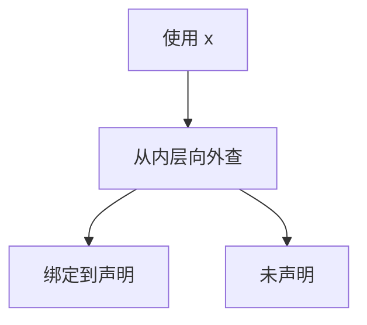

# 作用域与符号表

同一拼写在不同括号结构里可以指不同的绑定；符号表按作用域层叠，查找从内向外。

<footer>—— 据龙书第 2、6 章整理</footer>

上一课[访问者与遍](/cs/ast-visitor)给出了声明与使用的节点，但标识符仍是字符串。本课不重画 AST。缺口是：**绑定**——这个 `x` 指哪一次声明。词法作用域用块、过程、模块的嵌套；符号表是实现。类型是否匹配下一课才查。

## 问题

词法器已把标识符切出，CFG 不区分两个 `id`。若全局一张平表，内层声明无法遮蔽，块结束无法弹出。缺口是作用域栈：进入块 new 一层，声明插入当前层，查找从顶向下，离开块弹出。函数参数是一层，函数体是另一层或同一层带参数，按语言定。

动态作用域（按调用链查）不是本课主干；本栏默认词法作用域，与[调用约定](/cs/calling-convention-stack)的栈帧对应：编译期绑定，运行时只是访问链或静态链。

### 符号表不是散列课的复习

[散列](/cs/hash-function)是当前层的实现可选。结构是层叠映射：名字 $\to$ 声明记录（种类、类型占位、偏移稍后填）。本课要层叠与遮蔽，不重写链地址。

龙书用块结构语言当例子。C 的文件作用域与块作用域、函数原型的另层，细节不写完。后课类型检查假定每个使用已解析到唯一定义（或已报未声明）。

## 方法

遍历 AST。遇块：push。遇声明：当前层若已有同名则冲突（或合法重载，本课默认不允许）。遇使用：查找，失败则未声明。记录指针写回 AST 节点，后续不再比字符串。

模块导入、命名空间是多层中的横向边，本课点名：仍是查找路径，不是新的图算法。

## 机制

编译期符号表不必留到运行时；调试信息可以。运行时栈帧布局在 ABI 课按记录的偏移填。[RISC-V 寄存器](/cs/riscv-int-isa)还没选，偏移可以先按抽象槽。同名函数重载要带类型键，留给类型课。

宏与卫生宏会打乱「源里看见的名字」，本课不处理。

## 边界

本课不检查类型、不做隐式转换、不解析方法分派（虚表是后话）。不处理链接期的全局符号解析——那是[链接](/cs/link-reloc)的另一张表。后课默认：AST 上的名字已绑到声明。类型是否合法是下一课。

## 小结

- 词法作用域 = 嵌套层叠；内层遮蔽外层。
- 符号表实现查找；绑定写回 AST。
- 未声明与重复声明在本课报告。
- 出处：Aho et al., 龙书第 2、6 章。
