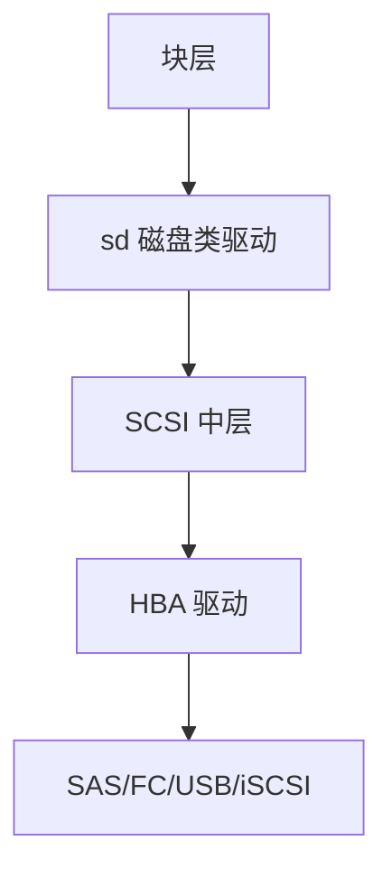

# SCSI 栈

Linux SCSI 把磁盘、磁带、光驱收成中层：命令描述块向下，块请求向上，主机适配器驱动只谈总线。

<footer>—— 据 T10 SCSI 架构模型；Linux SCSI 中层文档；McKusick 对 CAM 的对照</footer>

[上一课](/cs/nvme-driver)是寄存器队列。[块层](/cs/blk-schedulers) 下面还可以是 SCSI：SATA 经 libata 翻译、SAS、USB mass storage、iSCSI。缺口是 **SCSI 栈分层**：sd 磁盘驱动、中层错误处理、主机（HBA）驱动，而不是再讲 NVMe 门铃。

## 问题

命令是 CDB（读、写、同步缓存、查询）。设备按 LUN 寻址。错误：sense 数据、重试、设备复位、主机复位——中层有 EH 线程。缺口：块请求如何变成 SCSI 命令；分区与 udev 仍看见 `/dev/sd*`；与 NVMe 并存时，通用块层是共同上接口。本课不把 iSCSI 会话的 TCP 细节写成网络课。

UASP、virtio-scsi、光纤通道都接同一中层。timeout 与 `scsi_eh` 是生产上的延迟来源。教学上记住「命令+感测」而不是厂商工具。

## 方法

`sd` 把 bio 编成 READ/WRITE(10/16)，经中层排队到 HBA。完成回调把状态译成 blk 错误。对照 NVMe：多一次命令封装与错误模型。对照 [设备节点](/cs/device-nodes)：主次号来自 SCSI 探测。扫描：`REPORT LUNS` 或总线扫描。

## 机制

SCSI 栈让「块设备」在异质总线上保持同一用户接口。代价是锁、错误恢复与历史兼容。NVMe 绕开它是性能故事；企业阵列仍大量走 SCSI 模型（包括 NVMe 之前的 FC）。不要把本课写成存储面积网拓扑课。

与调度器：请求在进入 HBA 前仍可被 mq-deadline 排序；HBA 内部还有 TCQ。

实现上：错误处理线程会阻塞该主机上的 I/O 直到复位完成，这是 SCSI 尾延迟的常见来源。iSCSI 把同一 CDB 放进 TCP，丢包会让块层看到超时而不是以太网重传细节。 读法上只引用[上一课](/cs/nvme-driver)的结论，不把对象换成训练推理或限价簿。

本课在操作系统进阶的「存储栈 / 块层到设备」课序里，对象是 **SCSI 栈**。

- 先修只引用，不重导：上一课的结论当公理，本课只补差。
- 五栏不吞并：不把本课写成大模型训练/推理，也不写成限价簿或权重量化。
- 文献用 OSTEP、McKusick、内核文档与具名会议论文；不发明 arXiv 编号。

## 边界

本课不引入 SES 机箱管理、SCSI 保留/释放的集群锁全文。下一课在块设备之上再叠一层虚拟设备：device mapper 与 LVM。

版本字段会变，课序钉的是机制对象「SCSI 栈」，不是某一主线内核的结构体名。
后课默认：SCSI 中层把 CDB 送到 HBA。线性/条带/镜像的逻辑卷如何映射，下一课 dm/LVM。

## 小结

- SCSI：类驱动 + 中层 + HBA；CDB 与 sense。
- 与 NVMe 共享上边的块层。
- device mapper 是下一课。
- 出处：T10 SAM；Linux SCSI；McKusick CAM；Tanenbaum *MOS*。
