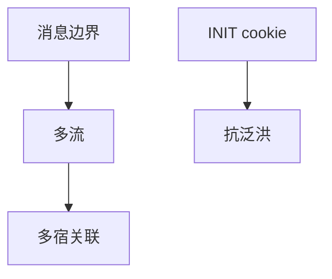

# SCTP 对照

SCTP 原生多宿与多流，消息边界保留，四次握手带 cookie 抗 SYN 泛洪；不是 TCP 的选项补丁。

<footer>—— 据 RFC 9260 SCTP；RFC 4960 历史整理</footer>

[MPTCP](/cs/mptcp) 在 TCP 上打补丁。[上一课](/cs/mptcp) 留下「为何不换协议」。缺口是 **SCTP 对照**：消息、多流无队头阻塞、INIT cookie。本课不把 QUIC 0-RTT 写完。

## 问题

信令（SS7 over IP）要多宿故障切换、要记录边界。TCP 是字节流，粘包后课才说。SCTP：DATA 块有流 ID，一流失序不挡另一流——对照后课 HTTP/2 与 QUIC。关联（association）可绑多地址。四次握手：INIT-ACK 带 cookie，状态在客户端回 COOKIE-ECHO 后才占 TCB，对象同 SYN cookies，但是一等公民。

不要把 SCTP 写成互联网默认：NAT 与中间盒支持远差于 TCP/UDP。

RFC 9260 现行。WebRTC 数据通道曾用 SCTP over DTLS。本课对照，不推部署。

### 原生多流多宿

消息边界保留，cookie 握手抗泛洪。NAT 支持差于 TCP/UDP。Web 路径上 QUIC 更常见。不是默认互联网运输。

## 方法

对照表：TCP / MPTCP / SCTP / QUIC：单位、多径、握手、部署。画：多流 → 公共拥塞窗口（或按实现）。与 UDP：SCTP 可靠可选，还有部分可靠扩展点名。

方法止于选定对象与对照；机制才说它如何嵌入已有分层与主干课。

## 机制

拥塞仍 AIMD 族，BDP 同样适用。心跳是协议内，比 TCP keepalive 更一等。不走 TSO 惯例路径，卸载少。RTO 与无线误码同样痛。EVPN 等与 SCTP 无关。

队头：SCTP 流避免传输 HOL，应用仍可自己造依赖。

## 边界

本课不引入 SCTP 认证块全文。QUIC 流与 0-RTT 是下一课。后课默认：SCTP 是另一运输；Web 路径上 QUIC 更常见。

防火墙只放 80/443 时 SCTP 出不去。

上一课留下的缺口在本课收口；「SCTP 对照」进入后课词汇表后只引用。文献用来钉对象与边界，不把本课写成该主题的独立综述。下一课[QUIC 流与 0-RTT](/cs/quic-streams-0rtt)。

## 小结

- 消息+多流+多宿是原生能力。
- Cookie 握手抗半开洪泛。
- 部署受 NAT/中间盒约束。
- 后课只引用本课钉死的对象，不从该领域总问题重开。
- 出处：RFC 9260。
