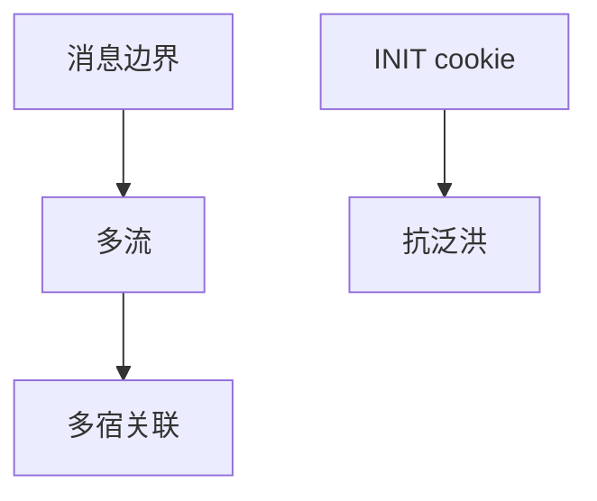
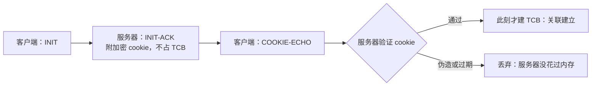

# SCTP 对照

SCTP 原生多宿与多流，消息边界保留，四次握手带 cookie 抗 SYN 泛洪；不是 TCP 的选项补丁。

<footer>—— 据 RFC 9260 SCTP；RFC 4960 历史整理</footer>

[MPTCP](/cs/mptcp) 在 TCP 上打补丁。[上一课](/cs/mptcp) 留下「为何不换协议」。缺口是 **SCTP 对照**：消息、多流无队头阻塞、INIT cookie。本课不把 QUIC 0-RTT 写完。

## 问题

信令（SS7 over IP）要多宿故障切换、要记录边界。TCP 是字节流，粘包后课才说。SCTP：DATA 块有流 ID，一流失序不挡另一流——对照后课 HTTP/2 与 QUIC。关联（association）可绑多地址。四次握手：INIT-ACK 带 cookie，状态在客户端回 COOKIE-ECHO 后才占 TCB，对象同 SYN cookies，但是一等公民。术语翻译：多宿就是「一条关联同时登记多个网络地址」的手段——主路径断了，数据自动切到备用地址；多流就是「一条连接里开多条互不阻塞的小车道」——一流丢包重传，另一流的消息照常交付，没有 TCP 那种全线排队。

不要把 SCTP 写成互联网默认：NAT 与中间盒支持远差于 TCP/UDP。

RFC 9260 现行。WebRTC 数据通道曾用 SCTP over DTLS。本课对照，不推部署。

### 原生多流多宿

消息边界保留，cookie 握手抗泛洪。NAT 支持差于 TCP/UDP。Web 路径上 QUIC 更常见。不是默认互联网运输。

## 方法

对照表：TCP / MPTCP / SCTP / QUIC：单位、多径、握手、部署。画：多流 → 公共拥塞窗口（或按实现）。与 UDP：SCTP 可靠可选，还有部分可靠扩展点名。

```mermaid
flowchart TD
  MSG["消息边界"] --> STR["多流"]
  STR --> ASSOC["多宿关联"]
  CK["INIT cookie"] --> ANTI["抗泛洪"]
```

## 机制

拥塞仍 AIMD 族，BDP 同样适用。心跳是协议内，比 TCP keepalive 更一等。不走 TSO 惯例路径，卸载少。RTO 与无线误码同样痛。EVPN 等与 SCTP 无关。

```mermaid
flowchart LR
  C1["客户端：INIT"] --> S1["服务器：INIT-ACK<br/>附加密 cookie，不占 TCB"]
  S1 --> C2["客户端：COOKIE-ECHO"]
  C2 --> V{"服务器验证 cookie"}
  V -->|"通过"| EST["此刻才建 TCB：关联建立"]
  V -->|"伪造或过期"| DROP["丢弃：服务器没花过内存"]
```

cookie 握手可以类比餐厅订位：TCP 三次握手是「客人一喊就先占一张桌子（TCB）」，假客人多了桌子被占光；SCTP 是「先发一张加密订位凭证」，客人带着凭证回来、验过真伪才真正安排座位——伪造者拿不出有效凭证，服务器全程没掏内存。

队头：SCTP 流避免传输 HOL，应用仍可自己造依赖。

## 边界

本课不引入 SCTP 认证块全文。QUIC 流与 0-RTT 是下一课。后课默认：SCTP 是另一运输；Web 路径上 QUIC 更常见。

防火墙只放 80/443 时 SCTP 出不去。初学者容易以为「协议更好就该替换 TCP」，实际部署约束先于协议优劣：NAT 与中间盒常按 TCP/UDP 的假设写死，防火墙只放行 80/443 时 SCTP 包根本出不了内网——这也是 QUIC 干脆「伪装成 UDP」的原因之一。

下一课[QUIC 流与 0-RTT](/cs/quic-streams-0rtt)。

## 小结

- 消息+多流+多宿是原生能力。
- Cookie 握手抗半开洪泛。
- 部署受 NAT/中间盒约束。
- 后课只引用本课钉死的对象，不从该领域总问题重开。
- 出处：RFC 9260。
