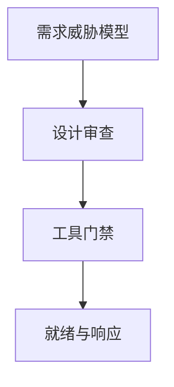

# SDL

安全开发生命周期把威胁建模、设计审查、工具门禁、事件响应写进版本列车。它是过程控制，不是一次扫描。微软 SDL 是公开的工程模板之一。

<footer>—— Howard and Lipner, *The Security Development Lifecycle*；Microsoft SDL；对照 McGraw</footer>

## 定位

上一课[TCB](/cs/tcb-minimization)要可审。缺口是**组织如何持续生产较小 TCB**：门禁。本课 SDL。

后课默认已经读完本课钉下的合同，只补差，不从该领域第一性原理重开。

## 问题

发布火车无安全活动则回归。缺口：需求阶段威胁模型、编译器与 sanitizer 门禁、依赖审查、就绪检查。

### 度量

漏洞密度与修复时间接风险课，不是 KPI 虚荣。

Howard–Lipner。seL4 下一课是另一极端：形式验证微内核。

## 方法

按阶段插已讲活动：fuzz、审查、SBOM。下一课 seL4 封课程。

图中节点是本课的机制骨架；课程不把图展开成可运行的攻击步骤。

## 机制

过程把课程合同变成列车上的门。形式验证下一课把微内核收到可机检证明。

前提写进合同之后，游戏外的误用只当失败模式点名，不在本课写成操作程序。

## 边界

不把 SDL 写成官僚表格。seL4 形式验证下一课。

## 小结

- TCB 要过程才能保持小。
- 威胁模型到门禁到响应是闭环。
- 工具是门，不是一次性扫描。
- 下一课 seL4 形式验证。
- 出处：Howard and Lipner；Microsoft SDL；McGraw。
