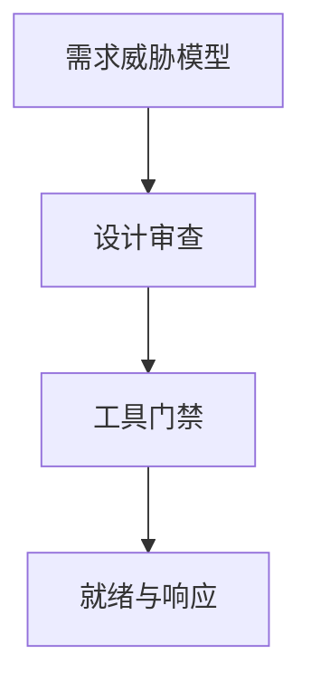
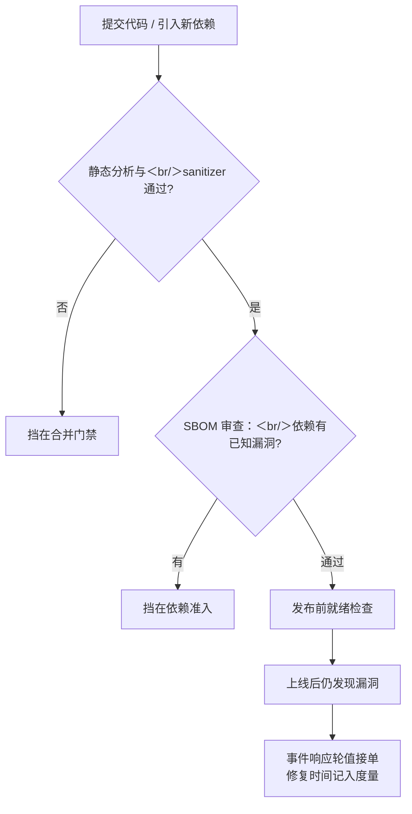

# SDL

安全开发生命周期把威胁建模、设计审查、工具门禁、事件响应写进版本列车。它是过程控制，不是一次扫描。微软 SDL 是公开的工程模板之一。

<footer>—— Howard and Lipner, *The Security Development Lifecycle*；Microsoft SDL；对照 McGraw</footer>

上一课[TCB](/cs/tcb-minimization)要求信任基可审；缺口是**组织如何持续生产较小的 TCB**——答案是写进发布过程：门禁。本课 SDL。

后课默认已经读完本课钉下的合同，只补差，不从该领域第一性原理重开。

## 问题

没有安全活动的发布火车会持续回归：每批新功能把旧缺口重开一遍。缺口是在四个位置插入活动——需求阶段做威胁模型，把「信任谁、防谁」写成设计约束；编译与测试挂 sanitizer 和静态分析当门禁；依赖进 SBOM 审查；发布前过就绪检查，事件响应留轮值。门禁可以类比机场安检：不是起飞前才查一次，而是每个登机口都设一道——代码每过一次构建就被查一遍，「带病提交」在合并前就被拦下。SDL 的全部主张，是把「查没查」从个人自觉变成流水线结构。

### 度量

度量要接住风险：漏洞密度与平均修复时间是过程健康指标；一旦直接当 KPI 考核，就会被「少报漏洞、关单求快」优化掉，变成虚荣指标。这是古德哈特定律的教科书案例：指标一旦成为考核目标，就会被优化指标本身而非它代表的东西——团队学会少报不修，密度「下降」而风险上升。正确读法是把密度与修复时间当健康趋势看，考核对象放在「门禁是否真的在跑」这类过程事实上。

Howard–Lipner。seL4 下一课是另一极端：形式验证微内核。

## 方法

方法是把课程已讲的活动按阶段插上火车：fuzz 挂测试，代码审查挂合并，SBOM 挂依赖准入，事件响应挂运维轮值。SDL 的主张是过程控制——门禁随每次构建自动执行，不是发布前的一次性扫描。下一课 seL4 封课程。

```mermaid
flowchart TD
  REQ["需求威胁模型"] --> DES["设计审查"]
  DES --> IMP["工具门禁"]
  IMP --> REL["就绪与响应"]
```

## 机制

SDL 的机制是把课程钉下的合同物化成列车上的门：威胁模型变成设计审查清单，sanitizer 变成合并门禁，SBOM 变成依赖准入。每道门把一类错误挡在发布之前；过程输出可审计，组织知识不随人员流动丢失。它不证明代码正确，只保证错误必须过门。形式验证下一课把微内核收到可机检证明。术语翻译：SDL 就是用「把安全活动变成不可跳过的门」的手段来做「让 TCB 不随功能迭代悄悄变大」的事——每批新功能想进主干，必须先证明自己没把旧缺口重开一遍。

```mermaid
flowchart TD
  MR["提交代码 / 引入新依赖"] --> G1{"静态分析与＜br/＞sanitizer 通过?"}
  G1 -->|"否"| REJ1["挡在合并门禁"]
  G1 -->|"是"| G2{"SBOM 审查：＜br/＞依赖有已知漏洞?"}
  G2 -->|"有"| REJ2["挡在依赖准入"]
  G2 -->|"通过"| REL["发布前就绪检查"]
  REL --> VULN["上线后仍发现漏洞"]
  VULN --> IR["事件响应轮值接单<br/>修复时间记入度量"]
```

## 边界

不把 SDL 写成官僚表格：每道检查项都要能说出它挡住的失效模式，说不出的一项就是纯开销。seL4 形式验证下一课。

## 小结

- TCB 要过程才能保持小。
- 威胁模型到门禁到响应是闭环。
- 工具是门，不是一次性扫描。
- 下一课 seL4 形式验证。
- 出处：Howard and Lipner；Microsoft SDL；McGraw。
