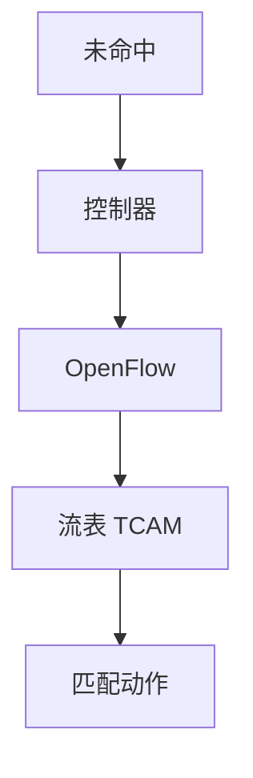

# SDN 与 OpenFlow

控制面从盒内协议簇里抽到控制器，交换机按流表匹配-动作转发；OpenFlow 是这条南向的一个历史接口。

<footer>—— 据 McKeown et al., OpenFlow, ACM SIGCOMM CCR 2008；RFC 7426 SDN 层整理</footer>

[上一课](/cs/tcam-lookup) 给出流表的硬件形状。传统盒内 BGP/OSPF 自闭环。缺口是 **SDN 分工**：控制器算全局，南向装表。本课不把 P4 语言写完。

## 问题

TE 与 ACL 在分布式协议里用属性暗示，难全局最优。SDN：逻辑中心看全拓扑，下发精确匹配。OpenFlow：匹配域（端口、MAC、IP、TCP）→ 动作（出端口、改头、去控制器）。失败模式：控制器分区、表满、反应式首包上送变成慢路径洪水。与 RR 对照：都是控制面中心化，OpenFlow 更细到每流。

不要把 SDN 写成「不用 BGP」的互联网替代：域间仍政策。

OpenFlow 交换机规范多版本。RFC 7426 分层。本课不把每个 match 字段列完。

### 南向之一不是互联网替代

控制器装流表，交换机匹配-动作。表满与控制器分区是失败模式。域间仍政策。

## 方法

画：控制器 → OpenFlow → 多级流表 → 流水线。对照 RIB/FIB：控制器相当于外置 RP。主动装表 vs 首包上送。

方法止于选定对象与对照；机制才说它如何嵌入已有分层与主干课。

## 机制

数据中心 Clos 可用 SDN 做负载与租户隔离，或用 BGP EVPN 做同一件事——两条工程路径。PFC 仍在数据面。安全：控制器被冒充则全网被改，南向要 TLS，对象与 BGP 认证同类。

与 Saltzer：中心控制是性能与政策优化，正确性仍要端到端。

## 边界

本课不引入 OVSDB/NETCONF 的全部。P4 可编程是下一课。后课默认：SDN = 控制/转发分离；OpenFlow 是南向之一。

反应式 SDN 在广域高 RTT（卫星）上首包延迟不可接受，应主动装表。

上一课留下的缺口在本课收口；「SDN 与 OpenFlow」进入后课词汇表后只引用。文献用来钉对象与边界，不把本课写成该主题的独立综述。下一课[P4 可编程](/cs/p4-programmable)。

## 小结

- 控制器装流表，交换机执行匹配-动作。
- 表容量与控制器可用是边界。
- 不自动取消域间 BGP。
- 后课只引用本课钉死的对象，不从该领域总问题重开。
- 出处：McKeown et al., 2008；RFC 7426。
