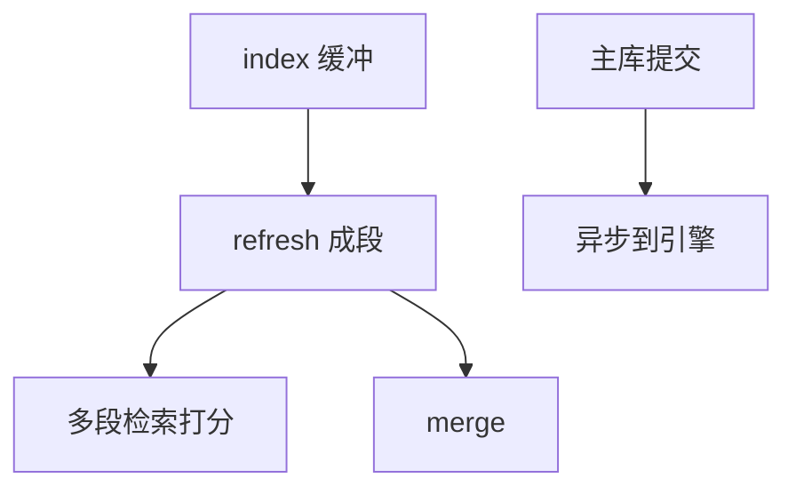

# 全文检索引擎

独立搜索引擎把倒排段、打分、分片做成集群：近实时可见靠刷新，不是 SQL 提交即搜。库内 GIN 是子集。

<footer>—— 据 Lucene 架构；Manning IR；倒排课的集群落地</footer>

[上一课](/cs/vector-db-ann)可与全文混合。本课专搜索引擎：Elasticsearch/Lucene 一族。缺口是相对库内全文：刷新间隔、副本分片、评分相关性、与主库 CDC 对齐。事务课的 D 在这里常是「近实时」，RPO 按刷新与 translog。

## 问题

文档进缓冲，refresh 成可搜段，search 多段归并，merge 后台——LSM 同构。缺口是 **SQL 事务 vs 可搜**：未 refresh 的文档搜不到，应用若以为提交即搜会错。CDC 从库到引擎是异步，读己之写要等 refresh 或搜主库。

分片：文档 id 哈希， scatter 查询再合并打分——分布式 top-k。相关性：BM25 在引擎，SQL `ORDER BY` 不是同一回事。

Lucene 段与 translog。本课集群合同。库内倒排课已有 posting。向量可作为 Lucene 字段。

## 方法

索引模板、mapping（分析器）。查询 DSL。与关系：主键同步、死信重试。权限：字段级安全 vs 后课行级安全在库。

容量：倒排内存、doc values 列存给排序聚合——引擎内 HTAP 雏形。

## 机制

一致性：副本等待可配，类似半同步。脑裂有选举。Jepsen 后课对搜索集群也测过丢失。优化：filter 上下文走位图缓存，query 上下文打分。

与 zone：段上的 doc 值 min/max 跳过。

## 边界

本课不讲 SQLite 页。也不把搜索当唯一真相库——主库仍权威。湖仓分析另一路。

后课默认：全文集群近实时；提交即搜要等或走库。SQLite 架构：嵌入式整库一份文件，另一极端。

搜索引擎是特化执行器+倒排存储，不是 Selinger 的通用 SQL。

## 小结

- 段+refresh+merge 近实时可搜；与 SQL 提交不同步除非等待。
- 分片 scatter 打分；CDC 对齐主库。
- SQLite 架构下一课。
- 出处：Lucene；Manning IR；LSM 对照。
