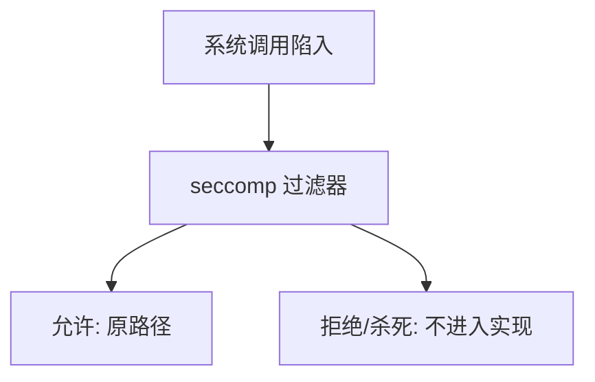

# seccomp 过滤

seccomp 在系统调用入口按过滤器决定允许、拒绝或杀死；过滤器看到的是调用号与参数的受限视图，不是攻击脚本。

<footer>—— 据 Linux seccomp(2)；内核文档对 BPF 过滤器的整理</footer>

[上一课](/cs/container-os)仍把完整系统调用表暴露给容器内进程。[系统调用路径](/cs/syscall-path) 在陷入后按号分发。缺口是**调用号过滤器**：在分发前截住，缩小内核攻击面。本课只讲机制与允许/拒绝结果，不讨论如何绕过过滤器。

## 问题

容器切了 pid 与根，`mount`、`ptrace`、稀有 ioctl 仍可能到达同一内核。若用户态策略是「只许 read/write/exit」，需要内核强制。seccomp-BPF：进程安装过滤器，此后每次系统调用跑该程序，返回允许、ERRNO、KILL 等。strict 模式更粗（只许极少调用）。缺口不是罗列调用号清单，而是：过滤器是只读的、可继承的、安装后通常不可再放宽。

过滤器不能当通用沙箱替代：仍共享内核。参数检查能力有限，不能替代 IOMMU 或用户命名空间。本课不给示例去探测内核。

## 方法

进程（或运行时在 exec 前）安装过滤器。陷入：硬件路径同前，内核在进入具体 syscall 实现前求值。允许则照常 copy 参数、执行；拒绝则不进入实现。与 ptrace 的对照：ptrace 可拦截但重、且用途是调试；seccomp 是声明式子集。容器运行时常用「默认拒绝 + 白名单」。

## 机制

seccomp 把「谁可以请内核做什么」从「有 fd 和 uid」再收一层到「有哪些 syscall」。它发生在 [syscall-path](/cs/syscall-path) 的门口，不改页表。与 setuid 不同：不提升身份，只减操作面。不能替代虚拟机：敏感特权指令若在用户态乱执行，仍是非法指令，不是 seccomp 的对象——下一课才把「客内核执行特权指令」当问题。

## 边界

本课不引入每条 BPF 指令的编写教程当攻击工具。不讨论如何使过滤器失效。下一课真正的虚拟化：客机认为自己在环 0，宿主要在敏感指令上陷入并模拟。

后课默认：本机进程的 syscall 面可裁。客内核的特权指令如何交给宿主，下一课陷阱与模拟。

## 小结

- seccomp 在 syscall 入口按过滤器允许或拒绝。
- 减面，不提供第二内核；本课无利用内容。
- 客机特权指令是 trap-and-emulate 的缺口。
- 出处：Linux `seccomp(2)`；内核 seccomp 文档。
