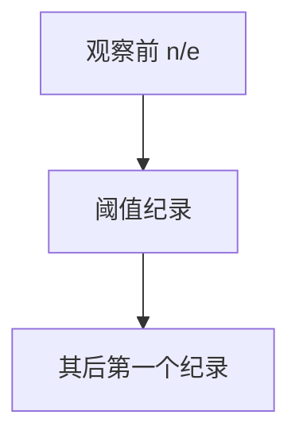

# 秘书问题

$n$ 个候选人依次出现、比较只见相对序；看过约 $n/e$ 个后录用下一个纪录，成功概率趋于 $1/e$。

<footer>—— 据 Dynkin；Gilbert and Mosteller, Recognizing the Maximum of a Sequence, 1966；标准最优停止整理</footer>

上一课[租买](/cs/ski-rental)是买断阈值。秘书：选最大，不可悔。缺口是 $1/e$ 规则。不重写竞争比的 $\rho$ 定义——本课是成功概率（随机排列）。后课老虎机另一不确定。排列均匀随机，不是对手任意权。

## 问题

见过 $i$ 后只知是否当前最大。拒绝不能再召回。最优：阈值 $r\sim n/e$，拒绝前 $r$，之后第一个超过前 $r$ 最大值的就选。$P(\text{选中全局最大})\to 1/e$。

缺口是最优停止，不是排序。若值为 i.i.d. 连续，等价于秩。

### 不是招聘的人力资源课

模型是随机排列。对手指定顺序可让任何算法失败。不要当确定性竞争比 $O(1)$——确定性看完才能保证最大。

Gilbert–Mosteller 1966。$1/e$ 古典。后课 UCB 是多臂，可重复拉。

## 方法

证明 $r$ 最优：成功 = 最大在 $j>r$ 且 $j$ 前缀最大在前 $r$。求和 $\approx \int_{r/n}^1 -\ln x\,dx$ 在 $r/n=1/e$ 最大。

$n$ 未知时另有策略，点名。

## 机制

信息与机会的折中：观察太少阈值差，太多已过最大。与 ski-rental：都是阈值；一个代价竞争，一个成功概率。与顺序统计。

## 边界

本课不写多选、不写折扣。后课默认：秘书 $n/e$ 规则，$1/e$。下一课多臂老虎机 UCB。

## 小结

- 随机排列下 $n/e$ 后录用纪录。
- 成功概率 $1/e$。
- 对抗顺序无常数保证。
- 出处：Gilbert and Mosteller, 1966。
