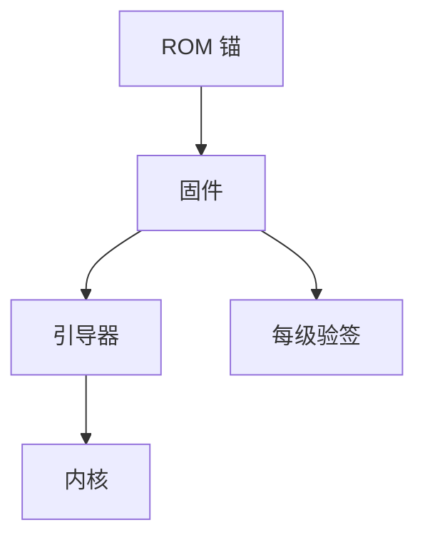

# 安全启动链

安全启动从不可变的 ROM 锚开始，每一级只启动被上一签过的下一镜像。链断在固件更新、密钥管理或「为了方便关掉验证」。

<footer>—— 据 UEFI Secure Boot；NIST SP 800-147；对照 Anderson 对启动完整性</footer>

## 定位

上一课[远程证明](/cs/remote-attestation)把度量送给别人。缺口是**本机启动路径**必须先有度量。本课讲 ROM→固件→引导器→内核，不写绕过安全启动的步骤。

后课默认已经读完本课钉下的合同，只补差，不从该领域第一性原理重开。

## 问题

无链则 rootkit 可先于内核加载。UEFI 数据库、PK/KEK/db。缺口是更新与双启动的密钥管理。

### measured boot

度量启动把哈希写入 PCR，供证明；安全启动是拒绝未签镜像。二者可并存。

SP 800-147。禁止绕过教程。固件安全下一课把更新与植入当主题。

## 方法

画签名链。对照安全启动失败时的砖机风险。下一课固件。

图中节点是本课的机制骨架；课程不把图展开成可运行的攻击步骤。

## 机制

启动完整是后续 MAC/TEE 的前提。固件被改则链从根上烂。

前提写进合同之后，游戏外的误用只当失败模式点名，不在本课写成操作程序。

## 边界

不写关闭验证。固件安全下一课。

## 小结

- 证明假设启动度量诚实；安全启动守本地链。
- ROM 锚到内核逐级验签。
- 更新与密钥是运营 TCB。
- 下一课固件安全。
- 出处：UEFI Secure Boot；NIST SP 800-147；Anderson。
