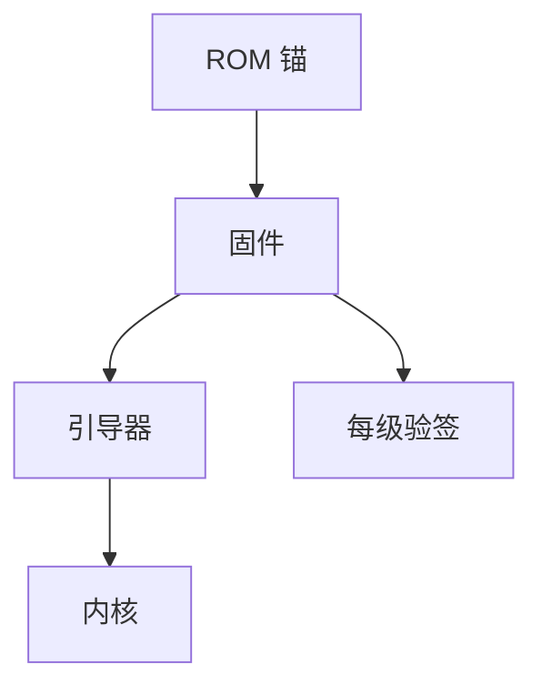
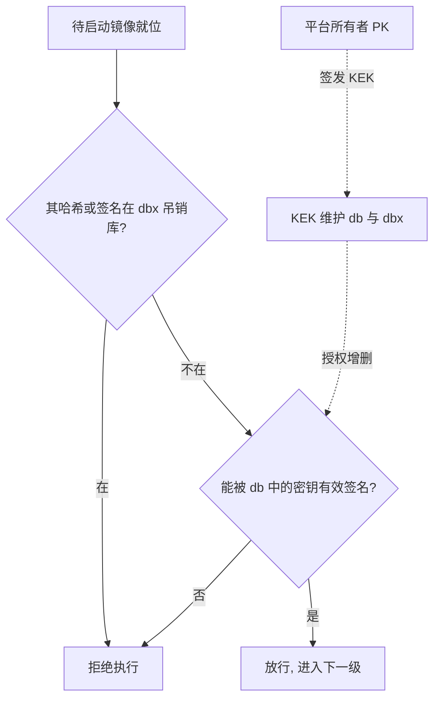

# 安全启动链

安全启动从不可变的 ROM 锚开始，每一级只启动被上一签过的下一镜像。链断在固件更新、密钥管理或「为了方便关掉验证」。

<footer>—— 据 UEFI Secure Boot；NIST SP 800-147；对照 Anderson 对启动完整性</footer>

上一课[远程证明](/cs/remote-attestation)把本机度量报给远端；它预设**本机启动路径的度量先要诚实**。本课讲这条链：ROM→固件→引导器→内核，不写绕过步骤。

后课默认已经读完本课钉下的合同，只补差，不从该领域第一性原理重开。

## 问题

没有这条链，rootkit 可以先于内核加载：引导扇区或固件里的植入对操作系统不可见——它就是「操作系统脚下的地面」。UEFI 安全启动的答案是密钥层级：PK（平台所有者）签 KEK（密钥交换钥），KEK 维护 db（可执行镜像的签名库）与 dbx（吊销库），固件只启动 db 内有签名的镜像。缺口是运营面的密钥管理：固件更新怎么签、自建模块与双启动系统怎么进白名单、dbx 吊销怎么推到存量机器。这套密钥层级翻译成大白话：PK 是「老板的公章」，只用来给 KEK 授权；KEK 是「部门的章」，负责往白名单 db 里添签名、往黑名单 dbx 里添吊销记录；固件本身只认名单不看人——镜像上有 db 里的章且不在 dbx，才放行。

### measured boot

区分两件事：安全启动是**拒绝**——未签镜像根本不执行；度量启动是**记录**——每级镜像的哈希链式写进 TPM 的 PCR，供远程证明读取。一个防执行，一个供审计，可并存且应当并存。

SP 800-147。禁止绕过教程。固件安全下一课把更新与植入当主题。

## 方法

方法是把签名链画全：ROM 锚不可变，固件验下一级固件，引导器验内核，每级只启动「被上一级签过」的镜像。运营要对照砖机风险：验证过严而更新流程出错，机器会拒绝合法系统启动——密钥轮换、恢复模式、AB 双库是这条链的运维面。下一课固件。可以把它想象成环环相扣的公证：直觉类比：最底层的公证员（ROM）物理上收买不了，之后每一级公证员只给「上一级盖过章的文件」再盖章——任何一环拒绝盖章，后面的文件就全部作废，这就是为什么链的强度等于最弱一环。

```mermaid
flowchart TD
  ROM["ROM 锚"] --> FW["固件"]
  FW --> LDR["引导器"]
  LDR --> OS["内核"]
  FW --> SIG["每级验签"]
```

## 机制

机制上，启动完整是后续一切的前提：内核的 MAC、TEE 的度量、远程证明的 PCR 值，全都假设「起点诚实」——固件被改则链从根上烂，上层做得再对也是假地基。安全启动的投入因此集中在「锚」：ROM 与根密钥不可变、不可调试——整台机器最贵的几平方毫米。下一课固件安全讲更新与植入。

固件对单个镜像的放行判定，本质是一次「先查黑名单、再查白名单」的两次查询：

```mermaid
flowchart TD
  IMG["待启动镜像就位"] --> X{"其哈希或签名在 dbx 吊销库?"}
  X -- "在" --> REJ["拒绝执行"]
  X -- "不在" --> D{"能被 db 中的密钥有效签名?"}
  D -- "是" --> RUN["放行, 进入下一级"]
  D -- "否" --> REJ
  KEK["KEK 维护 db 与 dbx"] -. 授权增删 .-> D
  PK["平台所有者 PK"] -. 签发 KEK .-> KEK
```

常见误区：初学者容易把「镜像通过验签」读成「镜像没有漏洞」——签名链只回答「谁签的、签完有没有被改」，签过名的固件照样可能带着已知的洞被利用，所以签名链必须配漏洞响应与 dbx 吊销流程才闭环。

## 边界

不写关闭验证的步骤；边界要点名：安全启动验证的是「谁签的」，不是「没有洞」——签过的固件带洞照样可被利用，签名链必须配漏洞响应流程。固件安全下一课。

## 小结

- 证明假设启动度量诚实；安全启动守本地链。
- ROM 锚到内核逐级验签。
- 更新与密钥是运营 TCB。
- 下一课固件安全。
- 出处：UEFI Secure Boot；NIST SP 800-147；Anderson。
