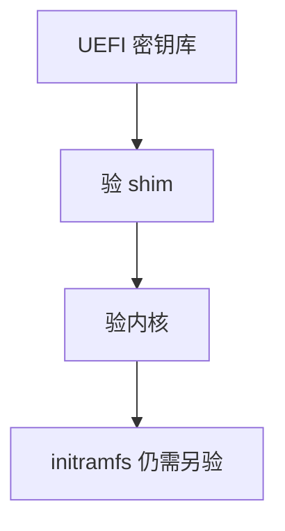

# 安全启动与签名

UEFI Secure Boot 用密钥验证引导加载器与内核签名，使未授权映像不能在这条链上启动——除非密钥被你或厂商控制。

<footer>—— 据 UEFI 规范对 Secure Boot 的说明；Linux 对内核模块签名与 MOK 的文档</footer>

[audit](/cs/kernel-audit) 记运行时。[加固](/cs/kernel-hardening) 假定内核是真的。缺口是 **启动时验证映像**：shim、MOK、与模块签名后课的分工点到启动链。

## 问题

恶意 bootloader 可在 LSM 之前赢。Secure Boot：固件用 PK/KEK/db 验签名。Linux：shim 验 grub/内核；用户 MOK 管自签。缺口：禁用 SB 的机器没有这条保证；密钥吊销 dbx。本课不把如何关 SB 当教程。

签名的是 PE/EFI 或内核镜像，不是 rootfs 全文——rootfs 要 dm-verity 等另一层。

## 方法

上电 → 固件验 boot 应用 → 验内核 → 启动。对照 [dm-crypt](/cs/dm-crypt)：加密防读，签名防改启动代码。对照 LSM：时间上签名更早。对照 [FUSE](/cs/fuse)：无关。

## 机制

安全启动把信任锚放到固件密钥，缩小「任意内核」攻击。锚被控则链无意义。不要写成 TPM 全文——下一课度量。与 [capabilities](/cs/linux-capabilities)：启动后才有进程。

发行版密钥与用户 MOK 的冲突是运维日常。

实现上：shim 的 MOK 让用户加自己的密钥，也让恶意者在已解锁机器上加密钥。内核签名过了不等于 initramfs 里的脚本可信，还要单独量。 读法上只引用[上一课](/cs/kernel-audit)的结论，不把对象换成训练推理或限价簿。

本课在操作系统进阶的「安全、启动与调试 / 内核安全与启动」课序里，对象是 **安全启动与签名**。

- 先修只引用，不重导：上一课的结论当公理，本课只补差。
- 五栏不吞并：不把本课写成大模型训练/推理，也不写成限价簿或权重量化。
- 文献用 OSTEP、McKusick、内核文档与具名会议论文；不发明 arXiv 编号。

## 边界

本课不引入每家 OEM 的定制。不保证嵌入式 ROM 引导同构。下一课 TPM 度量启动。

版本字段会变，课序钉的是机制对象「安全启动与签名」，不是某一主线内核的结构体名。
后课默认：引导映像可被固件验签。PCR 度量链，下一课 TPM。

## 小结

- Secure Boot 验引导链签名。
- 不自动验证整个根文件系统。
- TPM 度量是下一课。
- 出处：UEFI；Linux Secure Boot；shim/MOK。
