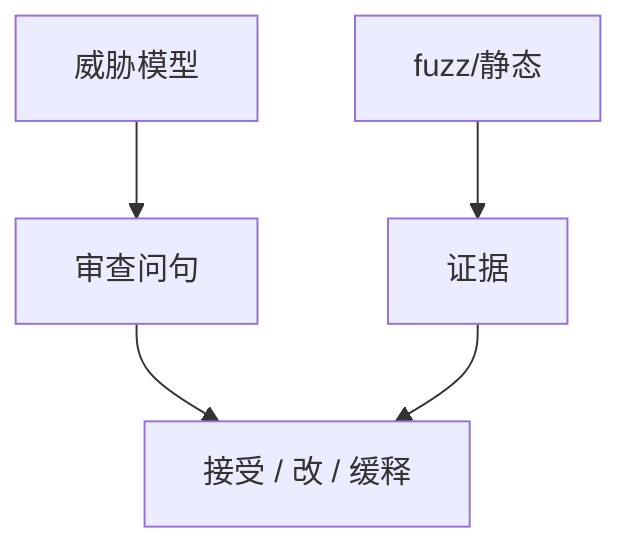

# 安全编码与审计

工具找一类洞；审查找一类设计。清单应对准本课程已钉的合同：AEAD、会话、输入当数据、最小权限。审计是抽样与威胁模型，不是把每一行标绿。

<footer>—— 据 McGraw, *Software Security*；OWASP 应用安全验证；Anderson 对流程</footer>

## 定位

上一课[依赖混淆](/cs/dependency-confusion)是供应。缺口是**自己写的代码**：编码规则与人审。本课给审查问句，不把审计当渗透操作手册。

后课默认已经读完本课钉下的合同，只补差，不从该领域第一性原理重开。

## 问题

fuzz 覆盖不到业务逻辑。审查：信任边界、认证、加密 API、错误处理、日志里的秘密。缺口是检查单与威胁模型对齐，不是风格指南。

### 检查单会过期

新框架默认值会变。清单要链到课，而不是抄一年前的博客。

McGraw。OWASP ASVS 可当覆盖表。本课不写对外部系统的攻击计划。

## 方法

按单元对照：密码学误用清单、会话旗标、内存 API、Web 解释器。要求高风险改动双人审。下一课 CVE/CVSS 是外部编号与评分。

图中节点是本课的机制骨架；课程不把图展开成可运行的攻击步骤。

## 机制

工程课把发现接到治理。CVE 下一课：洞如何被命名与比较严重度。

前提写进合同之后，游戏外的误用只当失败模式点名，不在本课写成操作程序。

## 边界

本课不代替渗透测试课。CVE 与 CVSS 下一课。

## 小结

- 依赖安全之后，审查自己的边界。
- 问句对准已学合同，不是泛「写得安全」。
- 工具与人审互补。
- 下一课 CVE 与 CVSS。
- 出处：McGraw, *Software Security*；OWASP ASVS；Anderson。
