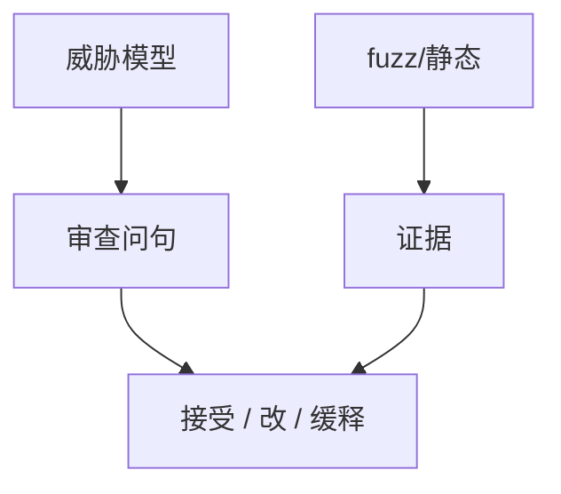
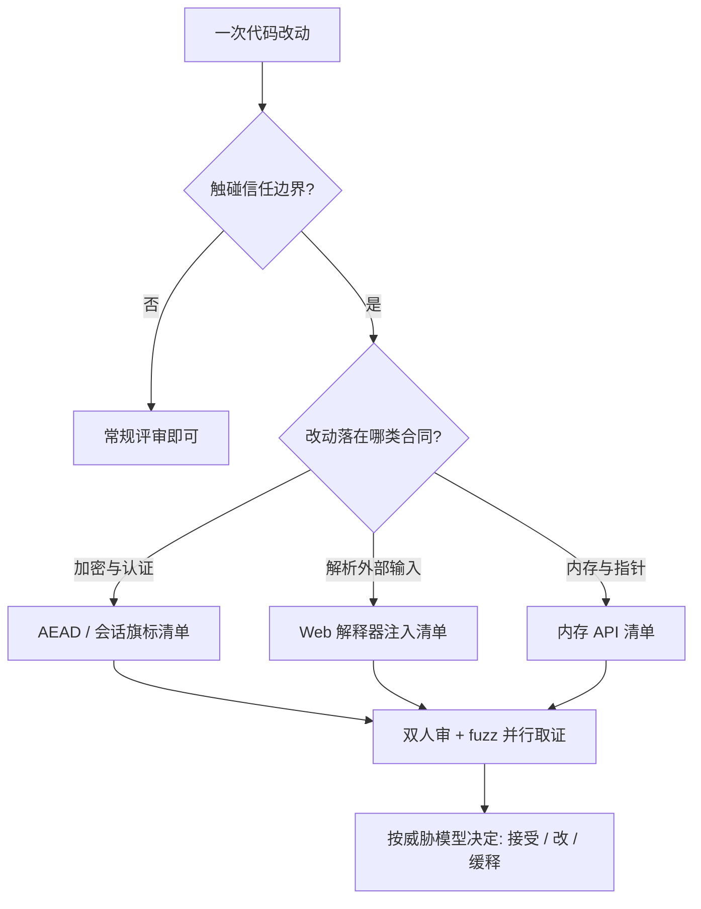

# 安全编码与审计

工具找一类洞；审查找一类设计。清单应对准本课程已钉的合同：AEAD、会话、输入当数据、最小权限。审计是抽样与威胁模型，不是把每一行标绿。

<footer>—— 据 McGraw, *Software Security*；OWASP 应用安全验证；Anderson 对流程</footer>

上一课[依赖混淆](/cs/dependency-confusion)是供应。缺口是**自己写的代码**：编码规则与人审。本课给审查问句，不把审计当渗透操作手册。

后课默认已经读完本课钉下的合同，只补差，不从该领域第一性原理重开。

## 问题

fuzz 覆盖不到业务逻辑。审查：信任边界、认证、加密 API、错误处理、日志里的秘密。缺口是检查单与威胁模型对齐，不是风格指南。「信任边界」翻译成大白话：数据从「别人手里」递到「你手里」的那条线——HTTP 请求体进服务、用户上传进解析器、另一个微服务的返回值进你的逻辑。线的两边可信级别不同，凡是跨线的数据都要当潜在的攻击输入对待。

### 检查单会过期

新框架默认值会变。清单要链到课，而不是抄一年前的博客。

McGraw。OWASP ASVS 可当覆盖表。本课不写对外部系统的攻击计划。

## 方法

按单元对照：密码学误用清单、会话旗标、内存 API、Web 解释器。要求高风险改动双人审。下一课 CVE/CVSS 是外部编号与评分。

```mermaid
flowchart TD
  TM["威胁模型"] --> LIST["审查问句"]
  TOOL["fuzz/静态"] --> EVID["证据"]
  LIST --> DEC["接受 / 改 / 缓释"]
  EVID --> DEC
```

## 机制

工程课把发现接到治理。CVE 下一课：洞如何被命名与比较严重度。

一次具体改动进审查时，人和工具是这样分工的：先按信任边界筛，再把命中的代码分派到对应的合同清单，fuzz 与静态工具在旁并行取证。

```mermaid
flowchart TD
  CR["一次代码改动"] --> TB{"触碰信任边界?"}
  TB -- "否" --> NORMAL["常规评审即可"]
  TB -- "是" --> WHICH{"改动落在哪类合同?"}
  WHICH -- "加密与认证" --> CRY["AEAD / 会话旗标清单"]
  WHICH -- "解析外部输入" --> WEB["Web 解释器注入清单"]
  WHICH -- "内存与指针" --> MEM["内存 API 清单"]
  CRY --> REV["双人审 + fuzz 并行取证"]
  WEB --> REV
  MEM --> REV
  REV --> FIX["按威胁模型决定: 接受 / 改 / 缓释"]
```

为什么工具和人审都不可省：fuzz 一天就能把解析器的越界撞出来，但它永远不会发现「会话 ID 生成后没有换发」这类要理解业务语义的设计错误——「工具找一类洞、审查找一类设计」说的就是这条分工线。

## 边界

本课不代替渗透测试课。CVE 与 CVSS 下一课。

常见误区：初学者容易以为「审一次、抄一份清单」就永久有效——框架默认值会变（比如某框架从宽松 Cookie 属性改成默认 SameSite），一年前的博客清单可能正是漏洞来源；所以本课要求清单链到已钉合同的课，而不是链到某一年的快照。

## 小结

- 依赖安全之后，审查自己的边界。
- 问句对准已学合同，不是泛「写得安全」。
- 工具与人审互补。
- 下一课 CVE 与 CVSS。
- 出处：McGraw, *Software Security*；OWASP ASVS；Anderson。
