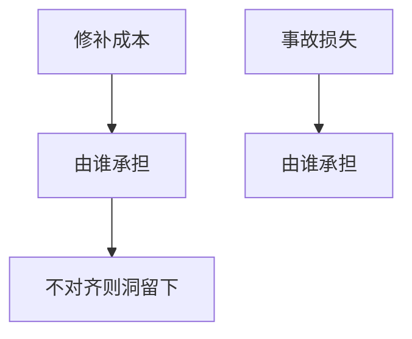

# 安全经济学

漏洞留下往往因为谁承担损失、谁承担修补成本不对齐。Anderson 问：激励，而不只是算法。补丁窗口、 visiblity、责任构成市场。

<footer>—— Anderson, Why Information Security is Hard, ACSAC 2001；Anderson and Moore, The Economics of Information Security, Science 2006</footer>

## 定位

上一课[Tor](/cs/tor-onion-routing)依赖志愿者中继。缺口是**激励**：谁付钱改进安全。本课经济学，接到金融栏的激励但不进 LOB。

后课默认已经读完本课钉下的合同，只补差，不从该领域第一性原理重开。

## 问题

负外部性：软件厂商不承担全部事故。缺口是：责任、保险、信息披露、赏金。

### 不是量化定价课

不把 CAPM 或限价簿搬进来。只谈安全主体的激励。

Anderson 2001/2006。可用安全下一课谈人。

## 方法

对照公地悲剧与赏金市场。下一课可用安全。

图中节点是本课的机制骨架；课程不把图展开成可运行的攻击步骤。

## 机制

技术控制在激励错时会被关。可用安全下一课：用户也会关。

前提写进合同之后，游戏外的误用只当失败模式点名，不在本课写成操作程序。

## 边界

不进量化微观结构。可用安全下一课。

## 小结

- Tor 靠激励维持中继；一般安全也靠激励。
- 损失与修补不对齐则洞留下。
- 赏金与责任是机制，不是道德说教。
- 下一课可用安全。
- 出处：Anderson, 2001；Anderson and Moore, 2006。
