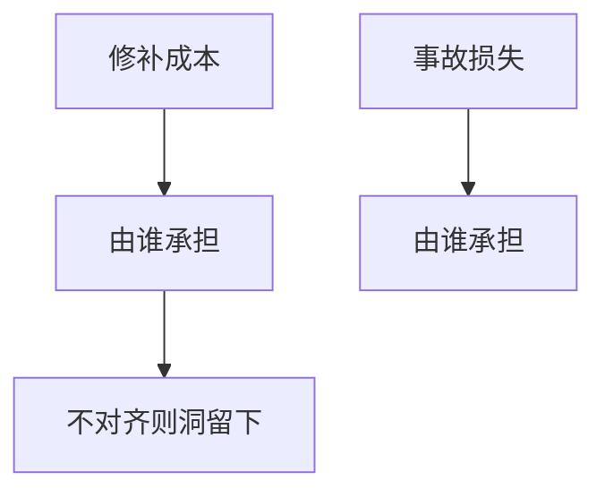
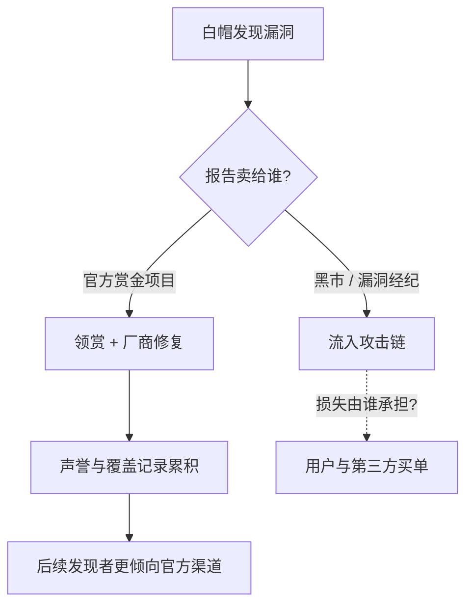

# 安全经济学

漏洞留下往往因为谁承担损失、谁承担修补成本不对齐。Anderson 问：激励，而不只是算法。补丁窗口、 visiblity、责任构成市场。

<footer>—— Anderson, Why Information Security is Hard, ACSAC 2001；Anderson and Moore, The Economics of Information Security, Science 2006</footer>

上一课[Tor](/cs/tor-onion-routing)依赖志愿者中继，而志愿者为什么不散、为什么总是不够，本身就是经济学问题。本课的缺口是**激励**：谁付钱改进安全。课程接到金融栏的激励主题，但不进限价簿。

后课默认已经读完本课钉下的合同，只补差，不从该领域第一性原理重开。

## 问题

核心失灵是负外部性：软件出事，损失大多落在用户与被波及的第三方，厂商只承担一小块，于是「修得更安全」的投资长期低于社会最优——漏洞留下，不是因为没人会修。缺口是四类改对齐的机制：责任分配、网络风险保险、披露政策、赏金市场。「负外部性」翻译成大白话：做决策的人不用承担决策的全部代价——厂商决定「这个洞下个版本再说」，出事赔钱的却是用户和被波及的其他公司；只要这个差价存在，理性的厂商就会持续少修。

### 不是量化定价课

本课不是量化定价课：不把 CAPM 或限价簿搬进来，只谈安全主体的激励结构。

Anderson 2001/2006。可用安全下一课谈人。

## 方法

方法拿两极对照：公地悲剧一极——共享生态里各自搭便车，没人维护公共安全；赏金市场另一极——给发现漏洞定价，把外部性变成收入。现实政策在两极之间滑动：强制披露时限、保险定价、按责任判赔。下一课可用安全。

```mermaid
flowchart TD
  COST["修补成本"] --> WHO["由谁承担"]
  LOSS["事故损失"] --> WHO2["由谁承担"]
  WHO --> GAP["不对齐则洞留下"]
```

## 机制

机制是：技术控制在激励错位时会被关闭——厂商默认配置向易用倾斜，管理员为保可用性关掉告警，因为事故成本不落在决策者头上。赏金与责任是改变支付流向的机制，不是道德说教：bounty 定价之后，白帽的时间机会成本被覆盖，漏洞流入修复流程而非黑市。可用安全下一课：用户也会关。

赏金机制改变的是发现者面前的支付表：同一个漏洞，两条出口的流向完全不同。

```mermaid
flowchart TD
  FIND["白帽发现漏洞"] --> CH{"报告卖给谁?"}
  CH -- "黑市 / 漏洞经纪" --> DARK["流入攻击链"]
  CH -- "官方赏金项目" --> BOUNTY["领赏 + 厂商修复"]
  BOUNTY --> REP["声誉与覆盖记录累积"]
  REP --> MORE["后续发现者更倾向官方渠道"]
  DARK -. "损失由谁承担?" .-> VICTIM["用户与第三方买单"]
```

数字实例：头部厂商的严重漏洞赏金常为数万美元一次，相当于一名工程师数月薪资——赏金定价的意义就在于覆盖白帽的时间机会成本，让他把报告送进修复流程比卖给黑市「划算」，机制替代了道德呼吁。

## 边界

不进量化微观结构；边界要点名：激励机制的度量本身困难——事故稀有、归因混乱，保险定价常靠类比而非数据支撑。可用安全下一课。

常见误区：初学者容易以为「漏洞存在 = 团队不会修」——Anderson 的论点恰恰相反：会修的人一直都在，缺的是让「修补的收益落到修补者头上」的支付结构；所以解决办法换机制（责任、赏金、保险），而不是换一批更努力的工程师。

## 小结

- Tor 靠激励维持中继；一般安全也靠激励。
- 损失与修补不对齐则洞留下。
- 赏金与责任是机制，不是道德说教。
- 下一课可用安全。
- 出处：Anderson, 2001；Anderson and Moore, 2006。
