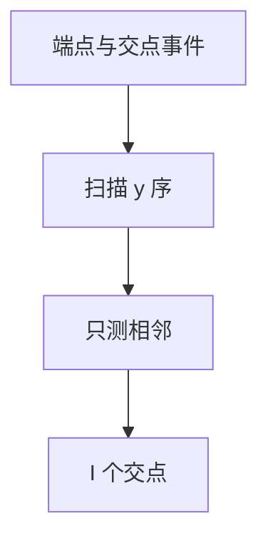

# 线段相交 Bentley–Ottmann

扫描线维护与竖线相交的线段 $y$ 序；只有相邻才可能先交，交点入事件队列，$O((n+I)\log n)$ 报出 $I$ 个交点。

<footer>—— 据 Bentley and Ottmann, Algorithms for Reporting and Counting Geometric Intersections, 1979；CLRS 第 33.2 节整理</footer>

上一课[最近点对](/cs/closest-pair)是点。线段两两交朴素 $O(n^2)$。缺口是 Bentley–Ottmann：端点与交点当事件，平衡树邻接。不重写矩形扫描。后课半平面交。精度问题收到鲁棒性课。

## 问题

一般位置：无三线共点、无竖线（旋转或特殊处理）。事件：左端插入、右端删除、交点交换相邻。只有树中相邻线段检测交。输出所有交或是否存在。

缺口是邻接不变式，不是暴力。

### 交点必须当事件

只扫端点会漏「后来才相邻」的交。BO 把交点插入队列。优先队列键为 $x$。

Bentley–Ottmann 1979。Chazelle 有更细理论。后课半平面交用对偶或双端队列。

## 方法

事件堆。扫描状态平衡树（按当前 $x$ 的 $y$）。插入/删/交换后检查新邻对。退化情况单独分支。

计数 $I$ 可达 $\Theta(n^2)$，算法输出敏感。

## 机制

最先发生的交必来自当时相邻对。交换后新相邻再测。与扫描线面积：结构都是线上序，事件种类多了交点。与平面图叠加同一家族。

## 边界

本课不处理全部退化的工业实现。曲线弧不写。后课默认：线段交输出敏感扫描。下一课半平面交。

## 小结

- 相邻线段才可能下一个交。
- $O((n+I)\log n)$。
- 交点入队列；注意退化。
- 出处：Bentley and Ottmann, 1979；CLRS 第 33.2 节。
