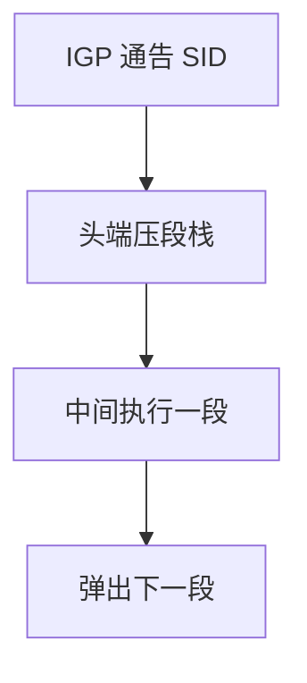

# 分段路由

路径编码进标签栈或 IPv6 段列表，中间节点只执行「到某前缀 / 某邻接」的段；状态从核心移到头节点。

<footer>—— 据 RFC 8402 Segment Routing 架构；RFC 8660 SR-MPLS；RFC 8754 SRv6 整理</footer>

[上一课](/cs/mpls) 用 RSVP 在中间保 LSP 状态。缺口是**无状态 TE**：SR 把段（前缀 SID、邻接 SID）叠在包头，IGP 洪泛 SID，头节点算栈。本课不把 ECMP 哈希极化写完。

## 问题

RSVP-TE 每条 LSP 在沿途维持软状态，规模随需求矩阵涨。SR-MPLS：栈里的标签是段，弹出即执行下一段。SRv6：IPv6 目的地址依次为段，中间匹配 SID。TI-LFA 用段绕开失败邻接，预计算比 RSVP 简单。头节点仍要算约束路径，复杂度没消失，只是移走。

不要把 SR 写成源路由的任意互联网：域内受 SID 空间与过滤约束，域间仍 BGP。

RFC 8402。IS-IS/OSPF 用 TLV 带 SID，接住 IS-IS 课的可扩展性。本课不把 SR-TE 策略的全部 BSID 写完。

### 状态移到头端

中间执行段指令，无每 LSP 软状态。邻接 SID 钉链路，前缀 SID 仍可 ECMP。外部注入 SID 要过滤。

## 方法

对照：RSVP 中间状态 vs SR 头端状态。画：IGP 洪泛 SID → 头端压栈 → 沿途执行。与 5G 切片对照：都是「把路径当资源」；一个在 WAN，一个在 RAN。

方法止于选定对象与对照；机制才说它如何嵌入已有分层与主干课。

## 机制

ECMP：前缀 SID 仍可在等代价边上哈希，邻接 SID 钉死一条链路——TE 用后者钉热点。MPLS 服务（L3VPN）可继续用内层标签，外层改 SR。RPKI 仍在 BGP 边；SR 不验证用户源地址。

SRv6 头开销更大，与巨帧/MTU 课衔接：路径 MTU 更易踩。

## 边界

本课不引入网络编程的全部 End.X 行为清单。ECMP 与哈希是下一课。后课默认：SR 是无状态中间的源路由式 TE。

过滤器必须防外部注入 SID，否则成攻击面。

上一课留下的缺口在本课收口；「分段路由」进入后课词汇表后只引用。文献用来钉对象与边界，不把本课写成该主题的独立综述。下一课[ECMP 与哈希](/cs/ecmp-hashing)。

## 小结

- 段是指令；栈在头端，中间无每 LSP 状态。
- IGP 分发 SID；邻接 SID 钉链路。
- SRv6 与 SR-MPLS 是两种数据面。
- 后课只引用本课钉死的对象，不从该领域总问题重开。
- 出处：RFC 8402；RFC 8660；RFC 8754。
