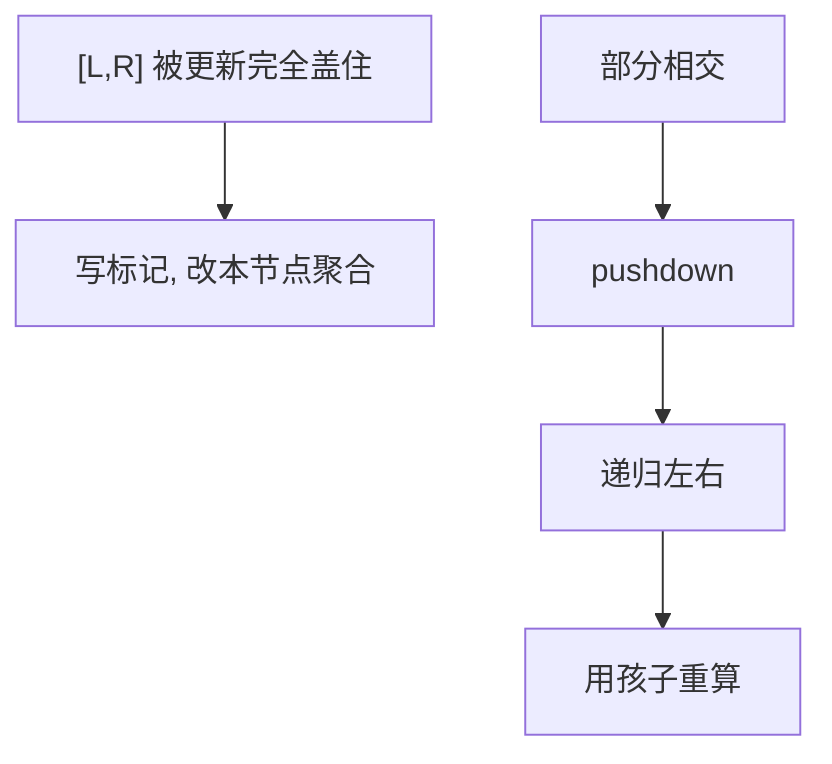

# 懒标记

更新若整段落在某个节点里，先在节点上挂账，不往下推；真要走进子树时再把账分给孩子。

<footer>—— 据 Cormen, Leiserson, Rivest and Stein 对区间树与延迟更新的整理；Sedgewick and Wayne 整理</footer>

[上一课](/cs/segment-tree)的点修只脏一条链。若对 $[l,r]$ 每个下标加 $d$，仍下到叶就是 $\Theta(r-l+\log n)$，区间一长就退回扫描。[差分](/cs/prefix-sum-difference)只能在「最后统一还原」的批处理里用，不能穿插任意查询。本课不重画对半切分。缺口是懒标记：覆盖节点立刻改聚合、记下「整段尚未下传的修改」，查询或更新碰到该节点再 `pushdown`。

## 问题

需要同时支持区间加（或区间赋值）与区间查询，且单次 $O(\log n)$。缺口不是新的树形，而是**把「应作用于整段的操作」缓存为标记**。标记必须与聚合可交换：先加后问和，等于把和加上 $d\times$ 长度；先加后问最小，等于最小加上 $d$。赋值标记会覆盖旧加，组合规则要写成幺半群，不能靠直觉叠。

标记下传：父的 tag 作用到左右孩子的值与 tag 上，父 tag 清空。任何走进左右之前必须先 pushdown，否则孩子是旧世界。

## 方法

更新 $[l,r]$：与查询一样拆节点；当当前 $[L,R]$ 被 $[l,r]$ 完全覆盖，应用标记并返回，不再递归。部分覆盖则先下传，再左右，再上传聚合。查询同样：先下传再走。复杂度仍 $O(\log n)$：完全覆盖的节点与点修路径同阶。

加法标记可累加。赋值标记替换。两者同时存在时要规定优先级（通常赋盖加），本课要求合同写清，不发明第三种。

## 机制

正确性：标记表示「该子树叶上尚未执行、但本节点聚合已当成执行后的值」。下传保持这个不变量。长度必须存在节点上（或由 $R-L+1$ 算），否则区间加无法更新「和」。

与差分对比：差分是全局一次还原；懒标记允许任意穿插查询，树一直是当前数组的聚合视图。常数比点修线段树大：每次访问可能多写两个孩子。

## 边界

本课不把历史版本、动态开点、或「标记不可结合」的操作写进来。不可下推的修改（依赖整段尚未物化的顺序）不要硬挂懒标记。下一课可持久化复制的是路径，与懒标记正交，可组合但本课不写组合实现。

后课默认：区间修改 + 区间查询用带懒标记的线段树。要访问旧版本，复制路径。

## 小结

- 懒标记把成段更新停在 $O(\log n)$ 个覆盖节点上。
- 走进子树必须先下传；标记与聚合要规定复合。
- 可持久化是另一缺口。
- 出处：Cormen et al.；Sedgewick and Wayne。
