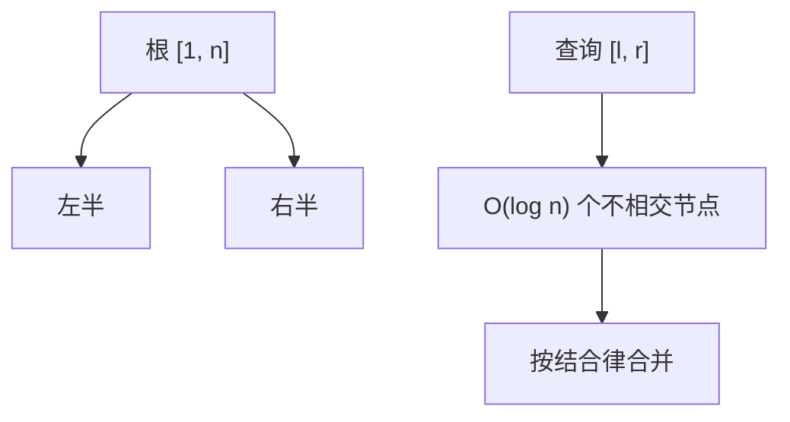

# 线段树

把下标区间递归对半切开，每个节点存自己那段的聚合；查询把目标区间拆成 $O(\log n)$ 个已有节点。

<footer>—— 据 Bentley, Solutions to Klee's rectangle problems, 1977；Cormen, Leiserson, Rivest and Stein；Sedgewick and Wayne 整理</footer>

[上一课](/cs/fenwick-tree)把加法前缀收成 $n$ 格的二进制索引。最值、任意结合运算、以及「查询任意 $[l,r]$ 而不先转前缀」并不贴 Fenwick 的 lowbit 形状。本课不重讲 $\mathrm{lowbit}$。缺口是线段树：一棵固定形状的区间二叉树，单点修改与区间查询 $O(\log n)$。

## 问题

静态稀疏表不能改；Fenwick 的区间切法绑在二进制进位上。需要：节点对应 $[L,R]$，左右孩子对半，叶对应单点。每个节点存 $\mathrm{op}(A[L..R])$，$\mathrm{op}$ 可结合。查询 $[l,r]$：从根往下，与当前节点区间全含则返回该节点值，相交则左右合并，不相交则单位元。缺口是**把任意区间规范成树上 $O(\log n)$ 个不相交节点**。

单点改：只更新根到该叶的路径，自底向上重算。

Bentley 的线段树原用于几何「线段与扫描线」；竞赛与数据库里常指这一棵下标区间树。不要与后课几何 interval tree 混名。

## 方法

建树 $\Theta(n)$：叶抄 $A$，内部 $\mathrm{op}(左,右)$。堆式下标：根 $1$，左 $2u$，右 $2u+1$，数组约 $4n$。查询与修改都沿高度 $O(\log n)$。单位元：加法是 $0$，最小值是 $+\infty$，须在合同里写明。

与稀疏表：线段树可改，查询 $O(\log n)$ 不是 $O(1)$。与 Fenwick：线段树对 $\mathrm{op}$ 只要求结合，不要求 lowbit 友好的前缀分解。

## 机制

任意 $[l,r]$ 在对半切分下最多被切成每层常数个片段，故节点数 $O(\log n)$。修改只脏一条叶到根的链，因为兄弟子树的聚合未变。这与[BST](/cs/bst) 不同：这里树形由 $n$ 固定，不随键旋转；下标就是键。

递归实现注意边界 $L=R$ 为叶。迭代版按位拆区间，本课不要求写完。空间 $O(n)$，常数大于 Fenwick。

## 边界

本课只钉点修、区间查询。区间加仍要扫叶则退回 $\Theta(n)$——下一课懒标记把更新停在覆盖节点上。可持久化、动态开点也不在本课。$\mathrm{op}$ 必须可结合；不可结合就不要放进节点。

后课默认：静态结合区间可更新时，线段树是默认树。成段修改用懒标记。

## 小结

- 线段树：对半区间树，点修与区间查询 $O(\log n)$。
- 运算可结合即可；形状由 $n$ 固定。
- 区间更新留给懒标记。
- 出处：Bentley, 1977；Cormen et al.；Sedgewick and Wayne。
