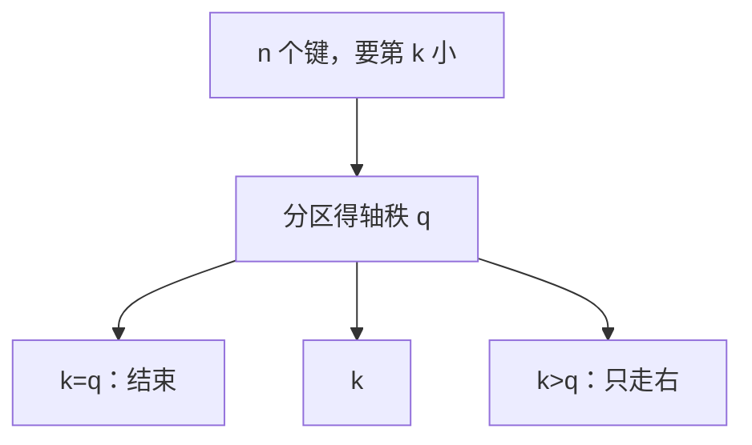

# 选择第 k 小

只要第 $k$ 小，不必排出全部次序；随机分区期望线性，最坏线性要五数取中那样的保证轴。

<footer>—— 据 Hoare, 1961；Blum, Floyd, Pratt, Rivest and Tarjan, Time Bounds for Selection, 1973；CLRS 第 9 章整理</footer>

上一课[基数与桶](/cs/radix-bucket)在整数键上排完全表。本课不重做计数。缺口是：比较模型里全排序仍有 $\Omega(n\log n)$ 墙，但**只问第 $k$ 小**信息量小得多。本课交出随机选择（期望线性）与最坏线性选择的存在，不把全表排序当子程序。

## 问题

一次分区后，轴的秩 $q$ 已知。若 $k=q$ 结束；若 $k<q$ 只递归左段，否则把 $k$ 改成 $k-q$ 递归右段。与快排不同：只走一侧。期望仍由随机轴给出 $T(n)\le T($均匀子规模$)+\Theta(n)$，解为 $\Theta(n)$。最坏仍可平方——与快排同一退化。

缺口因此不是新的分区，而是**单侧递归**把期望从 $n\log n$ 降到线性。全排序下界管不了选择：决策树只须区分「谁是第 $k$」，不是 $n!$ 个全排列。

### 五数取中不是默认实现

BFPRT：每五元组取中位数，再递归选这些中位数的中位数当轴，保证两侧都丢掉常数比例，最坏 $T(n)=T(n/5)+T(7n/10)+O(n)=\Theta(n)$。常数大，教学上证明最坏线性存在即可。主干实现仍是随机选择。

Hoare 的 FIND 即随机选择。Blum 等 1973 给出最坏线性。本课两者都点名：一个用，一个证明墙对选择是 $\Theta(n)$ 量级可及。

## 方法

随机：`partition`，比较 $k$ 与轴秩，单侧递归。期望线性；高概率也线性，本课不写浓度不等式。最坏线性：保证轴后同样单侧，主定理式的递推用替换法。

下界：每个键至少要被看过，故 $\Omega(n)$。与上界同阶（随机期望或 BFPRT 最坏）。

## 机制

选择是后课算法的零件：中位数作轴、统计量、BFPRT 自己的递归。图算法不在这里；最短路不是选第 $k$ 小边。也不把堆建成再弹 $k$ 次当成最优：那是 $n+k\log n$， $k$ 大时不如线性选择。

整数键上当然可以先计数再找第 $k$，那是上一课模型，本课强调比较模型里也能线性。

## 边界

本课不排完。不处理同时找多个顺序统计量的最优常数。多选问题、在线选择都不进主干。图与串从下一课开始，选择作为数组上的收尾。

后课默认：第 $k$ 小期望 $\Theta(n)$ 比较；最坏线性存在。数组算法到此；图上的遍历是下一缺口。

## 小结

- 选择只走分区的一侧，期望线性。
- 全排序下界不管选择；选择本身 $\Omega(n)$。
- BFPRT 证明最坏线性，常数大。
- 出处：Hoare, FIND；Blum et al., 1973；CLRS 第 9 章。
