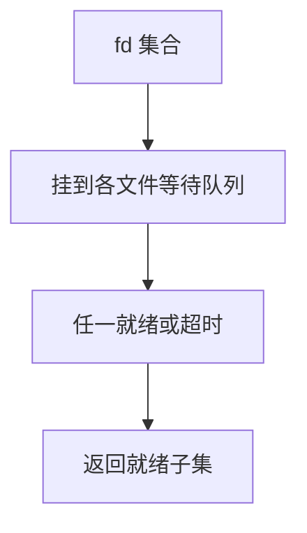

# select 与 poll

一次系统调用等待一组描述符上的可读、可写或异常；内核在任一就绪或超时后返回就绪集合。

<footer>—— 据 POSIX select/poll；Stevens, UNIX Network Programming 整理</footer>

[上一课](/cs/posix-shm)解决大块数据，没解决「许多通道何时有事件」。为每个 FIFO/套接字 fork 一个进程会炸。[信号掩码](/cs/sigmask) 的 pselect 已预告原子等。缺口是 **I/O 多路复用**：把睡眠从「一个 fd 的 read」变成「一组 fd 的就绪」。本课合并 select 与 poll，对照它们的接口裂缝。

## 问题

`read` 阻塞在一个 fd 上时，别的 fd 就绪也无法处理。非阻塞轮询浪费 CPU。[调度](/cs/scheduling-metrics) 需要可睡眠的等待。select：位图 `fd_set`，容量受 `FD_SETSIZE` 限制，每次调用内核扫描并改写位图。poll：`pollfd` 数组，无固定 1024 上限，仍要每次把数组拷进内核并线性扫描。缺口不是 epoll 的就绪队列——那是下一课。

就绪指：读不会阻塞（有数据或 EOF）、写不会阻塞（缓冲有空），或错误。水平触发：只要条件仍成立，下次还会报告。

## 方法

用户填集合，陷入内核。内核把进程挂到这些文件对象的等待队列上，超时用后课 jiffies/hrtimer 的睡眠。任一设备下半部唤醒对应队列，扫描集合，拷回就绪项，返回个数。与 [管道](/cs/ipc-pipe) 满/空睡眠是同一唤醒源，只是等待者在等「集合」而非单端。

## 机制

select/poll 让单线程事件循环成为可能：Web 服务器经典模型的起点。代价是 O(n) 每次调用。它们不代替 [VFS](/cs/vfs) 的 `read`；只告诉你现在调用 `read` 是否会睡。Unix 域、FIFO、后来的网卡套接字都实现同一 poll 操作向量。

## 边界

本课不把 `epoll` 提前当解决方案写完。不引入 Windows `WaitForMultipleObjects` 对照考试。信号与 I/O 同时等用 pselect，避免竞态。下一课针对「n 很大、每次就绪很少」改兴趣表。

后课默认：可以等一组 fd。规模上升后的兴趣表与边沿触发，下一课 epoll。

## 小结

- select/poll 睡眠等待集合就绪，水平触发。
- 每次调用扫描全部兴趣 fd，有规模问题。
- 内核侧就绪队列是 epoll 的缺口。
- 出处：POSIX；Stevens, *UNP*；Tanenbaum *MOS*。
