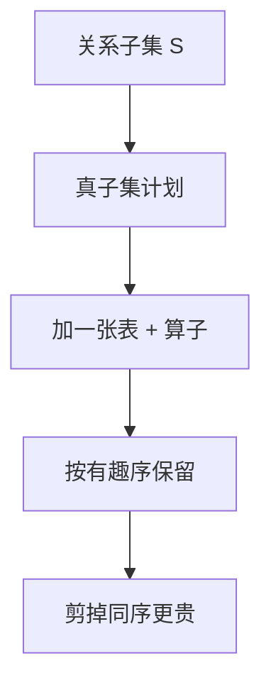

# Selinger 动态规划

System R 的优化器按关系子集做动态规划：每个子集保留若干有趣的有序计划，用代价剪掉被支配者。

<footer>—— 据 Selinger et al., Access Path Selection in a Relational Database Management System, SIGMOD 1979；Ramakrishnan and Gehrke</footer>

依赖理论在 [5NF 与反规范化](/cs/5nf-denormalization) 封口。本课打开优化器单元：主干 [代价估计](/cs/cost-estimate) 与 [查询计划](/cs/query-plan) 已有代价公式与物理树，但连接顺序怎么搜只留下「搜索」。缺口是 Selinger 动态规划（DP）：在左深树（及有趣序）上把指数空间收成 $O(3^n)$ 量级的子集 DP，而不是 $n!$ 穷举。

## 问题

$n$ 表内连接，左深树有 $n!$ 叶排列。每条边还要选算法（NLJ/哈希/归并）与访问路径（堆扫/索引）。穷举不可能。启发式（始终最小表在外）会在倾斜与相关谓词上翻车。缺口是**最优子结构**：一组关系的最优计划，由其真子集的最优计划拼接——若代价可加且无「有趣顺序」问题，标准 DP 即可。

有趣顺序（interesting order）：若上层排序、归并连接或 `GROUP BY` 能用到某序，则同一子集要保留多条计划：最便宜无序的、以及各有趣序上最便宜的。被支配（同序更贵）的剪掉。这是 Selinger 相对朴素 DP 的关键补丁。

Selinger et al., SIGMOD 1979，System R。代价用 CPU 与 I/O 加权。本课不把 System R 的实现表当现代优化器的全部，只钉 DP 骨架。

## 方法

对每个非空子集 $S$，枚举 $S = S_1 \cup \{R\}$（左深）或更一般的拆分（后课 bushy）。对 $S_1$ 的每个幸存计划与 $R$ 的访问路径，用连接算法生成候选，估基数与代价，按（序、代价）保留 Pareto。单表：索引与堆扫描的代价，谓词选择率来自 [直方图](/cs/histogram-card)。

外连接、半连接限制谁能当「下一张表」；DP 状态仍是子集，合法边更少。本课以内连接为主，点名限制。

## 机制

基数沿树传播：子计划输出行数 × 选择率。估错则 DP 精确优化错误数字——后课误差传播。DP 保证的是：在代价模型与左深限制下最优，不是真实运行时间最优。

计划缓存可把 DP 结果按语句形状存住；参数窥视改变选择率则应重跑 DP 或用通用计划。这与预编译课衔接，本课不重做缓存。

## 边界

本课不把 bushy 树、延迟笛卡尔积、DPccp 的连通子集枚举写完——下一课连接顺序搜索空间。也不校准代价常数。学习型优化器更后。

后课默认：多表连接用 DP（或等价动态规划）在有趣序下搜；启发式只是退化。搜索空间形状决定 $n$ 能到几。

System R 把「访问路径选择」与「连接顺序」放进同一 DP，不是两段无关脚本。

## 小结

- Selinger DP 按子集拼接计划，保留有趣序上的非支配者。
- 保证的是模型内最优，不是真实时间最优。
- 下一课：左深、右深、bushy 与连通性如何撑开搜索空间。
- 出处：Selinger et al., SIGMOD 1979；Ramakrishnan and Gehrke。
