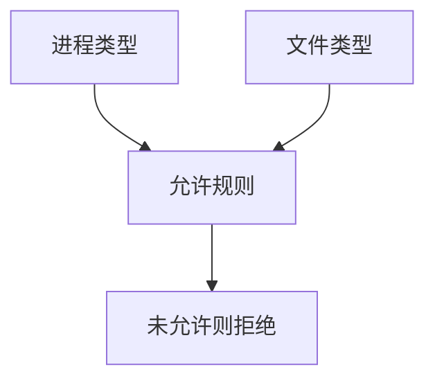

# SELinux 类型强制

类型强制给进程与文件打类型标签，规则只允许指定的类型对流。即便进程以 root 跑，也不能任意读未允许的客体。策略是规格，不是建议。

<footer>—— Loscocco and Smalley, Integrating Flexible Support for Security Policies into the Linux Operating System, USENIX 2001；NSA SELinux</footer>

## 定位

上一课[红蓝](/cs/red-blue-team)结束网络防御。系统单元从强制访问起。主干[DAC/MAC/RBAC](/cs/dac-mac-rbac)已给 MAC 名字。缺口是 **SELinux 类型强制**如何落到 Linux：标签、允许规则、最小特权。

后课默认已经读完本课钉下的合同，只补差，不从该领域第一性原理重开。

## 问题

DAC 的 root 全能。MAC：httpd_t 只能碰 httpd_sys_content_t 一类。缺口是策略编写与 permissive/enforcing，不是关闭 SELinux 当排错默认。

### 容器

容器常带自己的类型；错误的 unconfined 等于关掉这层。

Flask/TE。本课不写如何逃策略的步骤。提权下一课谈能力与 sudo 面。

## 方法

画主体类型、客体类型、允许。对照 AppArmor 路径名策略点名。下一课 Linux 提权路径：能力、SUID、配置。

图中节点是本课的机制骨架；课程不把图展开成可运行的攻击步骤。

## 机制

引用监视器在内核。策略错误会拒服务，于是有人关 SELinux——那是可用性打完整。提权课假设这层可能被配错。

前提写进合同之后，游戏外的误用只当失败模式点名，不在本课写成操作程序。

## 边界

不写逃逸策略。Linux 提权路径下一课只讲机制与硬化，不给利用步骤。

## 小结

- 红蓝之后，系统层用 TE 限制即便是 root 的进程。
- 标签加允许规则；enforcing 才是策略。
- 关 SELinux 排错是把 MAC 撤掉。
- 下一课 Linux 提权路径。
- 出处：Loscocco and Smalley, 2001；对照 [dac-mac-rbac](/cs/dac-mac-rbac)。
