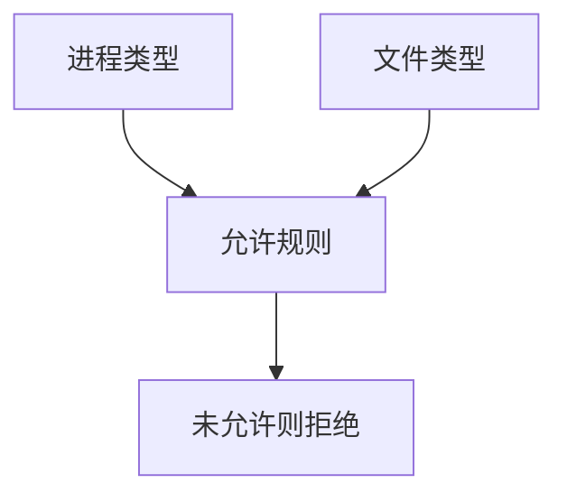
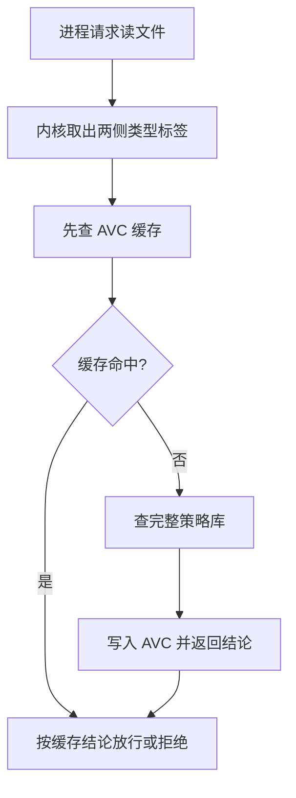

# SELinux 类型强制

类型强制给进程与文件打类型标签，规则只允许指定的类型对流。即便进程以 root 跑，也不能任意读未允许的客体。策略是规格，不是建议。

<footer>—— Loscocco and Smalley, Integrating Flexible Support for Security Policies into the Linux Operating System, USENIX 2001；NSA SELinux</footer>

上一课[红蓝](/cs/red-blue-team)结束网络防御。系统单元从强制访问起。主干[DAC/MAC/RBAC](/cs/dac-mac-rbac)已给 MAC 名字。缺口是 **SELinux 类型强制**如何落到 Linux：标签、允许规则、最小特权。

后课默认已经读完本课钉下的合同，只补差，不从该领域第一性原理重开。

## 问题

DAC 的 root 全能。MAC：httpd_t 只能碰 httpd_sys_content_t 一类。缺口是策略编写与 permissive/enforcing，不是关闭 SELinux 当排错默认。

直觉类比：类型强制像机场安检——旅客（进程类型）和货舱（文件类型）各挂一个标签，规则写明哪类旅客能带哪类货。它不看「这位旅客是谁」，所以哪怕你是贵宾（root），该查的照样查。

常见误区：初学者容易把 SELinux 设成 permissive（只记日志不拦截）当「关掉排错」。实际上这层检查仍在跑，只是违规从「拦下」变成「写进 audit 日志」；正确姿势是先看 denied 记录，再补允许规则。

### 容器

容器常带自己的类型；错误的 unconfined 等于关掉这层。

Flask/TE。本课不写如何逃策略的步骤。提权下一课谈能力与 sudo 面。

## 方法

画主体类型、客体类型、允许。对照 AppArmor 路径名策略点名。下一课 Linux 提权路径：能力、SUID、配置。

```mermaid
flowchart TD
  SUB["进程类型"] --> RULE["允许规则"]
  OBJ["文件类型"] --> RULE
  RULE --> DENY["未允许则拒绝"]
```

## 机制

引用监视器在内核。策略错误会拒服务，于是有人关 SELinux——那是可用性打完整。提权课假设这层可能被配错。

上面那张图回答「允许规则由什么拼成」；下面这张回答一次真实的读文件请求在内核里走哪条路——先查缓存还是先查策略，决定了这一步的开销。

```mermaid
flowchart TD
  A["进程请求读文件"] --> B["内核取出两侧类型标签"]
  B --> C["先查 AVC 缓存"]
  C --> D{"缓存命中?"}
  D -- "是" --> E["按缓存结论放行或拒绝"]
  D -- "否" --> F["查完整策略库"]
  F --> G["写入 AVC 并返回结论"]
  G --> E
```

术语翻译：AVC（Access Vector Cache，访问向量缓存）就是内核把最近用过的「类型对 → 允许/拒绝」结论缓存起来的手段，用来省掉每次翻策略库的开销——策略库是厚厚的规则手册，AVC 是贴在手边的便签。

## 边界

不写逃逸策略。Linux 提权路径下一课只讲机制与硬化，不给利用步骤。

## 小结

- 红蓝之后，系统层用 TE 限制即便是 root 的进程。
- 标签加允许规则；enforcing 才是策略。
- 关 SELinux 排错是把 MAC 撤掉。
- 下一课 Linux 提权路径。
- 出处：Loscocco and Smalley, 2001；对照 [dac-mac-rbac](/cs/dac-mac-rbac)。
