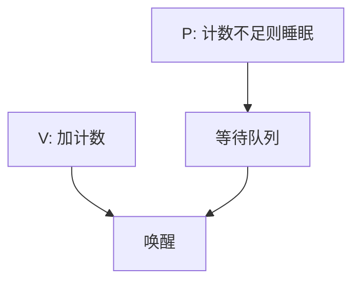

# 信号量

P 操作减少信号量并可能睡眠，V 操作增加并可能唤醒；计数把互斥与资源个数写成同一种对象。

<footer>—— 据 Dijkstra, Cooperating Sequential Processes, 1965 整理</footer>

[上一课](/cs/seqlock)给出二元互斥。管道满/空、缓冲区槽位、一次性事件，要的是「还剩几个」以及「没有就睡」。缺口不是再发明一种原子指令，而是把锁字推广成**计数**，并把睡眠/唤醒收进原语——信号量。

## 问题

自旋锁在临界区长或条件暂不成立时浪费 CPU。睡眠互斥锁能等「锁被释放」，但不能表达「等三个槽位空出来」。Dijkstra 的信号量 $S$ 是整数：`P(S)` 原子地等 $S\gt 0$ 再减一，`V(S)` 加一并唤醒。互斥是 $S$ 初值为 $1$ 的特例。缺口是这条原语，不是新的调度器。

本课不把 Linux `down_interruptible` 的信号可打断语义写完。

二元信号量像锁，但习惯上不绑定「持有者」：V 可以由另一进程做，这既是灵活也是后课管程要收紧的来源。

## 方法

内核实现：`P` 在关中断或持自旋下检查计数，不够则把线程挂到该信号量的等待队列并切换；`V` 加计数，若有等待者则唤醒。用户库可经系统调用使用。生产者—消费者：空槽与满槽两个信号量，外加互斥保护头尾指针——互斥仍用上一课的锁或第三个信号量。

## 机制

信号量把[调度](/cs/scheduling-metrics)与同步接起来：睡是阻塞状态，V 把人放回就绪。管道的「满写睡」正是对缓冲剩余空间做 P。与纯锁不同，V 可以在中断下半部调用（若实现允许），从而设备完成直接对应「多了一个满槽」。

计数没有类型系统：对错的信号量做 V 会悄悄破坏不变量。这是下一课管程用语言括号把条件等待收进去的动机。

## 边界

本课不把管程当信号量的宏展开讲完，不引入 barrier、rwlock 的全部变体。也不把 System V 信号量数组的 API 背下来。死锁可以在多信号量上发生，条件在再后一课。

P 在被信号打断后是否重做，属于接口；课内默认 P 会完成或明确失败，不把 EINTR 表背完。

忙等信号量极少见，计数等待的意义就是去睡眠。

后课默认：可以用 P/V 等待资源个数。希望「锁与条件在同一模块里由编译器看管」，下一课管程与条件变量。

## 小结

- 信号量是带睡眠的计数；互斥是初值为一的特例。
- P/V 把阻塞与唤醒做成原语，对接调度。
- 误用 V 难以检查，推动管程。
- 出处：Dijkstra, *Cooperating Sequential Processes*, 1965；Silberschatz et al., *OSC*。
