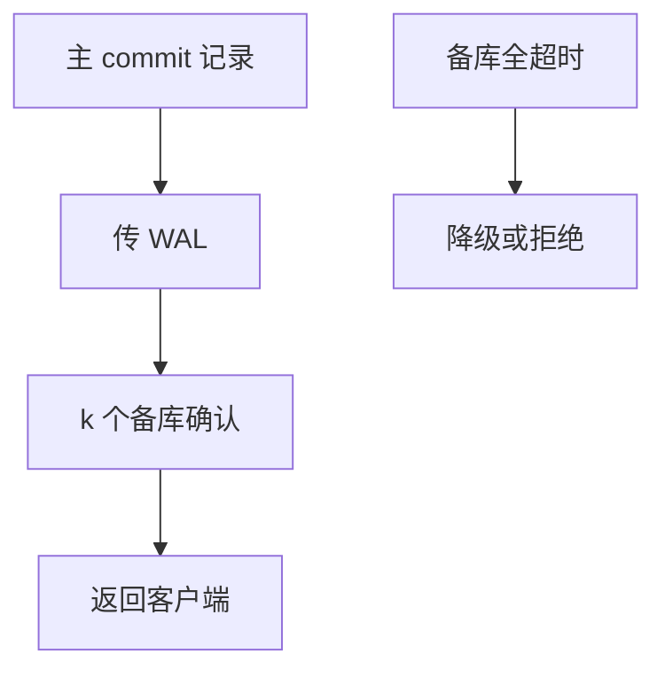

# 半同步复制

提交返回前至少一备库收到日志：RPO 相对异步收紧，延迟相对全同步放松。仍可能在窗口里丢，合同要写「几个 ACK」。

<footer>—— 据 Gray 复制；MySQL 半同步；Postgres 同步复制级别</footer>

[上一课](/cs/logical-replication-cdc)把流送给异构下游。本课回到同构 HA：异步复制 RPO 大（主挂丢未传送日志）；全同步每备都 fsync 则延迟差。半同步（semi-sync）：等待 $k$ 个备库 ACK（常 $k{=}1$）再让提交返回。持久性等级课的③/④ 落地。

## 问题

ACK 语义：收到内存 vs 已 fsync，差一档 RPO。缺口是**主挂时选谁**：已 ACK 的备库有提交，未 ACK 的可能落后——升主要选最前，并处理裂脑。半同步在备库全挂时的降级：等还是退异步，上一课 D 等级已问。

性能：提交延迟 ≈ 组提交 + 网络 RTT + 备库刷盘。跨 AZ 明显。组提交窗口可等一批一起发，与半同步叠加。

MySQL after_sync/after_commit 差异是产品坑。Postgres `synchronous_commit` 与 `synchronous_standby_names`。本课 k-ACK 机制。

## 方法

配置 k 与名单。监控复制延迟、ACK 超时。超时降级要告警。只读备库可异步，不进 k。

与 2PC：半同步不是跨分片原子，只是单主日志的耐久扩展。跨分片仍 2PC 或 Calvin。

## 机制

乱序：备库 apply 可落后于收到；若 ACK 只表示收到，升主后还要 apply 完才服务——RTO 含追平。若 ACK=apply+fsync，延迟更大、RTO 更干净。

脑裂：旧主复活仍接写，需 fencing（STONITH、时间线 id）。后课分布式会再遇。

## 边界

本课不量化读己之写的会话粘滞——下一课。也不把仲裁多数派当半同步（那是共识）。Spanner 后课。

后课默认：要小 RPO 用 k-ACK 同步复制；要低延迟用异步并接受丢失窗口。复制延迟与读己之写：会话读备库看见旧值。

半同步收紧的是提交日志的故障域，不是隔离级别。

## 小结

- k 个备库 ACK 再返回，RPO/延迟可调。
- ACK 是收到还是 fsync 必须写清；降级要告警。
- 复制延迟与读己之写下一课。
- 出处：Gray；MySQL/Postgres 同步复制。
