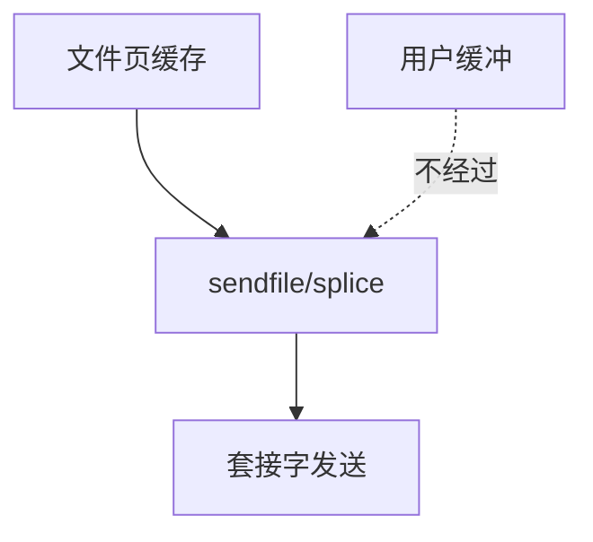

# sendfile 与 splice

sendfile 把文件页直接送进套接字发送队列；splice 用管道当中转，让两个 fd 在内核里接力，而不经过用户缓冲。

<footer>—— 据 Linux sendfile(2)、splice(2)；Niels Provos 等对零拷贝服务器的实践讨论</footer>

[上一课](/cs/posix-aio)仍假设数据有一份用户缓冲。[页缓存](/cs/page-cache) 里已经有文件帧，静态 Web 还把它 `read` 进用户再 `write` 到套接字——两次拷贝。缺口是 **sendfile/splice**：内核内搬运。文件系统接口课序在此收口，下一课序进入块层。

## 问题

`read`+`write`：内核→用户→内核。sendfile：从文件 fd 的页缓存把页挂到 socket 的 sk_buff（或等价物），DMA 出网卡。splice：任意两个可拼接的 fd，经 pipe 缓冲。缺口：何时必须拷贝（用户不能 DMA 的页、加密、checksum 卸载失败）；与 [O_DIRECT](/cs/direct-io) 文件组合的限制；`TCP_CORK`/`MSG_MORE` 如何攒包——网络细节点到为止，对象是 FS 与套接字的接头。

`copy_file_range` 是文件到文件的亲戚。本课不把 sk_buff 结构写完，那是网络栈第一课。

## 方法

静态文件：`open` 文件，`sendfile(out_sock, in_file, &off, len)`。内核 `do_splice_to` 从 file 拉页，`do_splice_from` 推向 socket。若页需修改（如加 TLS 头），走一次拷贝。对照 mmap+write：仍可能拷；sendfile 意图是避免用户态触及。对照 FUSE：用户态 FS 的页可能无法零拷贝。

## 机制

零拷贝把服务器 CPU 从 memcpy 里解放，使瓶颈回到设备与协议栈。它不替代 [fsync](/cs/fsync)，也不保证 `O_DIRECT` 源。不要把「零拷贝」写成绝对：统计、cgroup、安全钩仍可能碰数据。与预读：sendfile 顺序发文件会触发同一套预读，这是性能上的朋友。

文件系统进阶到此：布局到接口都已接到「字节如何离开内核」。下一单元从块层调度器开始，那些页最终要排成对设备的请求。

实现上：TLS 内核卸载或需要修改字节时，零拷贝会降级。splice 进管道受管道容量限制，大文件要循环。copy_file_range 可在 FS 内克隆块（reflink），那是另一条减拷贝。 读法上只引用[上一课](/cs/posix-aio)的结论，不把对象换成训练推理或限价簿。

本课在操作系统进阶的「文件系统实现 / 接口进阶」课序里，对象是 **sendfile 与 splice**。

- 先修只引用，不重导：上一课的结论当公理，本课只补差。
- 五栏不吞并：不把本课写成大模型训练/推理，也不写成限价簿或权重量化。
- 文献用 OSTEP、McKusick、内核文档与具名会议论文；不发明 arXiv 编号。

## 边界

本课不引入 eBPF 改包、TLS 内核卸载的全部套件。不保证每张网卡的 scatter-gather 成功。存储栈第一课：请求在块层如何排队——mq-deadline 与 BFQ。

版本字段会变，课序钉的是机制对象「sendfile 与 splice」，不是某一主线内核的结构体名。
后课默认：文件页可不进用户空间就送走。块层调度器如何排这些请求，下一课。

## 小结

- sendfile/splice 在内核把文件页交给管道或套接字。
- 失败回退到拷贝；不替代持久语义。
- 块层调度是下一单元。
- 出处：Linux `sendfile(2)`、`splice(2)`；*OSTEP* 对 I/O 路径；Stevens 对 sendfile 的背景。
