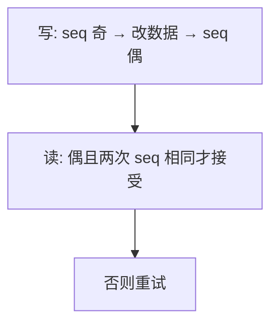

# seqlock

写者把序列号加奇数再写数据再加成偶数；读者读前后序列，奇数或变化则重试——读侧不持锁。

<footer>—— 据 Love, Linux Kernel Development；内核文档对 seqlock 的整理</footer>

[上一课](/cs/rwlock)的读计数仍是共享写，读者多时乒乓，写者还可能饿。时钟、统计一类**写少、数据小、读者可重试**的对象适合另一合同：读者永不挡写者。缺口是 **seqlock**（顺序锁）：版本号 + 写者互斥，读者无锁采样。本课钉重试协议，不把 RCU 宽限期写完。

## 问题

读者若只读一个字，原子加载够。读者若读两个相关字段，普通加载可撕裂。seqlock：写者获取内部自旋（或 mutex），`seq++` 成奇，写字段，`seq++` 成偶。读者：读 seq 为偶，读字段，再读 seq；若不同或为奇，重试。缺口不是 rwlock 的兼容矩阵，而是**写优先、读可失败重来**。

读者临界区不能有副作用：因为可能重试多次。也不能在读侧睡眠指望一致性，除非改用别的原语。

## 方法

写者之间仍互斥，保证 seq 与数据配对。读者用 acquire 语义读 seq，防止把数据读提前到第一次 seq 之前——对接[内存屏障](/cs/memory-barrier-os)。写很频繁时读者会活锁式重试，于是不适合写多的对象。

IRQ 里可以读 seqlock；写者若也在 IRQ，要按锁与 IRQ 纪律选自旋变体。

## 机制

seqlock 把一致性从「锁内看见」换成「采样到偶数版本」。它消灭读侧锁字写入，写者不会被读者挡。读者无所有者、无 PI。与后课 RCU 不同：seqlock 读者可能看见撕过的中间态并扔掉，RCU 读者看见的是完整旧版或完整新版。本课只预告，不展开宽限期。

## 边界

本课不把 `seqcount` 与 latch 的全部变体写完。也不能用 seqlock 保护链式结构的遍历（中间结点可能被释放）——那是 RCU 或锁。信号量下一课在已有课里；按树，seqlock 之后是[信号量](/cs/semaphore)。

后课默认：小数据、写少、读可重试用 seqlock。计数与条件等待回到 Dijkstra 的 P/V，下一课[信号量](/cs/semaphore)。

## 小结

- seqlock：写者改版本号，读者校验两次序列；读不挡写。
- 读者必须可重试、无副作用；写多会让读者空转。
- 计数式等待是信号量课。
- 出处：Love, *LKD*。
