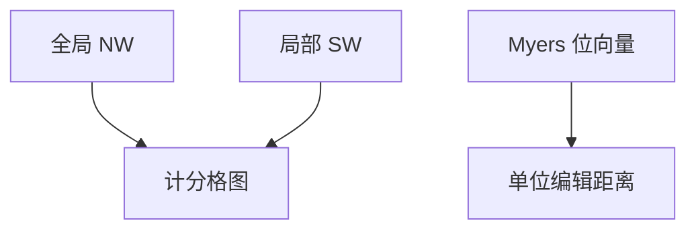

# 序列比对与位并行

比对是带分的编辑；Myers 用位运算把格图一列打进机器字，$O(nm/w)$ 算单位代价距离。

<footer>—— 据 Needleman and Wunsch, 1970；Smith and Waterman, 1981；Myers, A Fast Bit-Vector Algorithm, 1999；[word RAM](/cs/word-ram) 对照整理</footer>

上一课[编辑距离与 Hirschberg](/cs/edit-distance-hirschberg)给了单位代价格图。生物比对：匹配加分、错配罚、缺口罚；全局 Needleman–Wunsch，局部 Smith–Waterman。缺口是计分矩阵与**位并行**：后课 word RAM 再抽象模型，本课先用。不重写 Hirschberg。本单元 DP 还剩最优 BST 与 Knuth。

## 问题

NW：全局对齐两端。SW：任意子串对，DP 多一项与 0 取 max。仿射缺口：三种状态（匹配/开缺口）Gotoh $O(nm)$。单位代价 Levenshtein 可用 Myers：把 $\Delta$ 编码成位向量，沿模式预处理，文本扫描 $O(nm/w)$。

缺口是计分与字并行，不是新的最优子结构。

### 不是 Transformer 注意力

序列对齐是 DP 格图，不是注意力权重。本课 CS 算法，不写神经网络对齐。

Needleman–Wunsch 1970。Smith–Waterman 1981。Myers 1999 bit-vector。后课最优 BST 回到树形区间 DP。

## 方法

NW/SW 填表。需要路径则前驱或 Hirschberg 变体。单位距离用 Myers 位向量。长序列启发式（BLAST）点名，不保证最优。

字母表小利于位掩码预处理。

## 机制

SW 的 $0$ 截断对应「重新开始」。Myers：水平/垂直差的进位用字内移位模拟格图依赖。与 KMP：KMP 精确无误差；比对允许误差。与 FFT：卷积可做无缺口打分，缺口仍 DP。

## 边界

本课不写多序列比对（NPC）。不写隐马尔可夫 profile。后课默认：全局/局部比对是带分 DP；单位距离可位并行。下一课最优二叉搜索树。

## 小结

- NW 全局、SW 局部；仿射缺口三状态。
- Myers 把单位距离做到 $O(nm/w)$。
- 启发式检索不是精确 DP。
- 出处：Needleman and Wunsch, 1970；Smith and Waterman, 1981；Myers, 1999。
