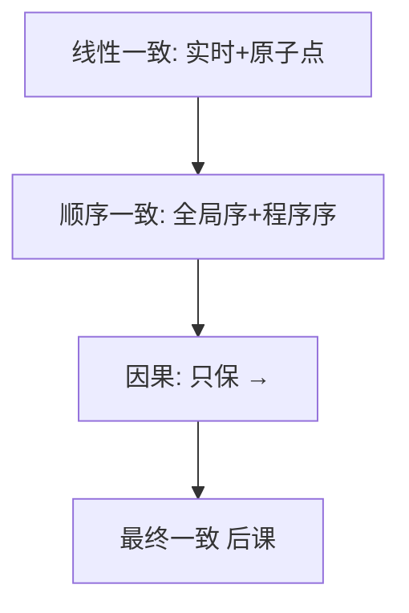

# 顺序与因果一致性

顺序一致要有一个全局操作序，符合每进程程序序，但不须符合实时。因果一致只要求 happened-before 的写被看到的顺序不颠倒。

<footer>—— 据 Lamport, How to Make a Multiprocessor Computer That Correctly Executes Multiprocess Programs, IEEE TC 1979；Ahamad et al., Causal Memory, 1995 整理</footer>

上一课[线性一致性](/cs/linearizability)把实时也算进顺序。缺口是**更便宜的档**：多核与广域复制常常放弃实时，只保留程序序或因果。本课不重画线性化点。后课最终一致还要再放弃「何时看到」。

## 问题

Lamport 顺序一致：存在全体操作的全序，每处理器上的程序序是该全序的子序，读看到的是该全序下最近的写。允许：实时上 A 已返回、B 才调用，历史仍把 B 排在 A 前——只要没人在中间用程序序钉住。这比线性一致弱，比「随便缓存」强。

因果一致（Ahamad 等因果内存）：若写 $w_1\to w_2$（[向量时钟](/cs/vector-clocks)的偏序，含程序序与同步），则任何读不能先看到 $w_2$ 再看到 $w_1$ 缺席的那种颠倒。并发写可以不同副本不同序。缺口：复制要在「全局全序」和「只保因果」之间选预算。

顺序一致没有线性一致的局部性：两个顺序一致对象并排放，组合不必顺序一致。因果常用版本向量或因果广播实现。

## 方法

实现顺序一致：单总线、单日志、或每读拉全局屏障——贵。实现因果：写带依赖向量，读缓冲直到依赖到齐；或因果广播（Birman 等）。不要用 NTP 排序冒充因果。

PRAM（流水线内存）更弱：只保**同一进程**写的顺序，跨进程写可乱。本课点名，以免和因果混称。

## 机制

多核硬件提供的是更弱的模型（store buffer），靠 fence 升到需要的档——那是体系结构课的内存模型，本课只借用「档位」语言，不重写 store buffer。分布式里：从库异步 apply 常常连因果都破（先 apply 了无依赖的新写）。要因果，复制流必须按依赖或按单日志。

线性一致 ⇒ 顺序一致 ⇒ 因果一致，逆不成立。选档是给应用的承诺：锁的互斥通常要线性一致；协作编辑的插入因果可能够；计数器最终一致可能够。

本课不把「因果一致」写成区块链的确认规则，也不写限价簿撮合序。

## 边界

本课不写会话保证的六条（那是后课把因果再拆成客户端视角）。不引入 CRDT 合并。后课默认：放弃实时先落到顺序或因果；再放弃「所有人终见同一写集合的同一全序」就进最终一致。主备协议必须声明自己停在哪一档。

档位是历史集合，不是 QPS 数字。没有声明就没有正确性讨论。

## 小结

- 顺序一致：全局全序 + 程序序，不必实时。
- 因果一致：不颠倒 $a\to b$ 的写可见性；并发可分叉。
- 线性 ⇒ 顺序 ⇒ 因果；实现成本同向。
- 出处：Lamport, IEEE TC 1979；Ahamad et al., 1995。
