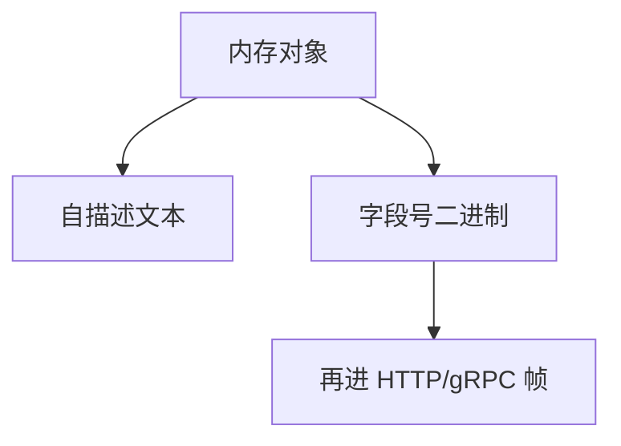

# 序列化：JSON / Protobuf

JSON 是自描述文本，便于调试与浏览器；Protobuf 是带 schema 的二进制，省带宽与 CPU。都是应用编码，不是 HTTP。

<footer>—— 据 RFC 8259 JSON；Protobuf 语言指南整理</footer>

[上一课](/cs/rest-grpc) 假定有一种编码。[内容协商](/cs/content-negotiation) 可选 `application/json`。缺口是**编码本身**：字段、版本、与报文成帧。本课结束 HTTP 与 Web 协议课序。

## 问题

进程内存结构不能直接上[套接字](/cs/socket-api)。JSON：Unicode 文本、对象图、无原生二进制（用 base64）。Protobuf：字段号、varint、向前兼容靠未识别字段保留。gRPC 默认后者。压缩可再叠 gzip，但 Protobuf 已密，收益小。schema 演化：加可选字段易，改语义难——与 DB 模式后课不同栏，这里只钉报文。

不要把 Protobuf 写成加密。

RFC 8259。Protobuf 是 Google 开文档的 IDL。本课不把每种 IDL（Thrift/Avro）列完。

### 编码不等于成帧

JSON 自描述；Protobuf 靠字段号。无长度前缀仍会粘包。schema 演化属于合同。

## 方法

对照：可读 vs 紧凑；有无 schema。画：结构 → 字节 → 解析。与线路码对照：一层在 PHY，一层在应用。粘包后课：Protobuf 消息仍要长度前缀或 gRPC 帧。

方法止于选定对象与对照；机制才说它如何嵌入已有分层与主干课。

## 机制

CPU：JSON 解析在 10G 上可成瓶颈，TSO 帮不上。QUIC 0-RTT 重放对非幂等 POST+JSON 危险。CDN 可缓存 GET+JSON，难缓存 gRPC。IPv6 过渡不影响编码。

安全：JSON 炸弹、Protobuf 递归深度是解析器边界。

## 边界

本课不引入 ASN.1 的全部。DNS 缓存与 TTL 是下一课序第一课。后课默认：JSON 易互通；Protobuf 要 schema 与帧。

无长度的 JSON 流会粘包，不能只靠 TCP。

上一课留下的缺口在本课收口；「序列化：JSON / Protobuf」进入后课词汇表后只引用。文献用来钉对象与边界，不把本课写成该主题的独立综述。下一课[DNS 缓存与 TTL](/cs/dns-cache-ttl)。

## 小结

- JSON 自描述；Protobuf 靠字段号与 schema。
- 编码不等于运输，还要成帧。
- 演化规则属于合同，不是语法边角。
- 后课只引用本课钉死的对象，不从该领域总问题重开。
- 出处：RFC 8259；Protobuf 文档。
