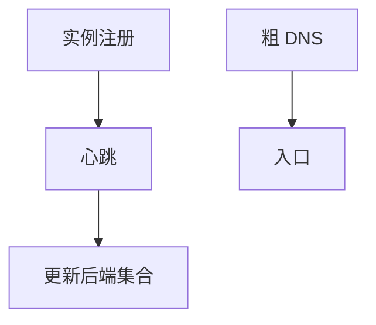

# 服务发现

实例上下线比 DNS TTL 快；发现把名字映到健康地址集合，LB 再从中选。DNS、注册表、网格是三条路。

<footer>—— 据 RFC 1035 对照；微服务发现实践整理</footer>

[DNS TTL](/cs/dns-cache-ttl) 太慢跟不上容器。[反向代理](/cs/reverse-proxy) 需要后端列表。[上一课](/cs/reverse-proxy) 假定池已知。缺口是**发现**：注册、健康、订阅。本课结束实时与分发课序。

## 问题

虚拟机/容器秒级生灭。权威 DNS + 60 s TTL 会指向死 IP。服务发现：实例启动向注册表报，心跳，代理 watch 变化。DNS 仍可用于粗入口。gRPC 客户端也可直连发现。与 BGP 对照：都是通告可达，一层应用实例，一层前缀。EVPN Type 2 是数据中心版 MAC 发现。

不要把 Kubernetes 当唯一标准。

接口因平台而异。本课钉问题：比 DNS 更短的生命周期。

### 比 DNS TTL 更短的生命周期

注册加心跳更新池。无健康检查只是更快的错误 DNS。注册表分区会脑裂。未认证注册像劫持。

## 方法

对照：DNS / 注册表 / sidecar 网格。画：注册 → 健康 → 推送到 LB。与 Maglev 表更新衔接。

方法止于选定对象与对照；机制才说它如何嵌入已有分层与主干课。

## 机制

失败：注册表分区造成脑裂双池。与 iBGP RR 同类风险。GeoDNS 发现的是 POP，不是 pod。PTP 无。安全：未认证注册会把流量拐走，像 BGP 劫持的数据中心版。

客户端负载均衡 vs 代理：状态放哪。

## 边界

本课不引入某注册表 API 全文。ping/iperf 是下一课序第一课。后课默认：发现提供健康实例集；DNS TTL 不够细。

无健康检查的发现只是更快的错误 DNS。

上一课留下的缺口在本课收口；「服务发现」进入后课词汇表后只引用。文献用来钉对象与边界，不把本课写成该主题的独立综述。下一课[ping / iperf](/cs/network-measurement)。

## 小结

- 实例生命周期短于 DNS TTL。
- 注册+心跳更新 LB 池。
- 控制面可用性决定数据面正确。
- 后课只引用本课钉死的对象，不从该领域总问题重开。
- 出处：DNS 对照；服务发现实践。
