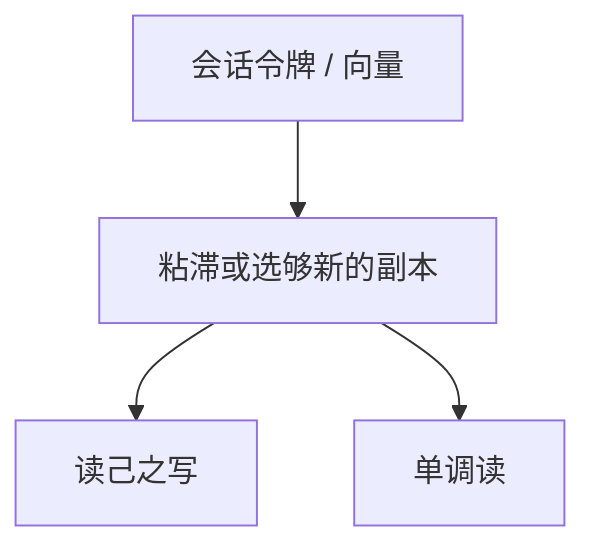

# 会话保证

全局可以最终一致，单个客户端仍要求：读到自己的写、单调读、因果读。保证绑在会话，不绑在全系统线性化点。

<footer>—— 据 Terry, Demers, Petersen, Spreitzer, Theimer and Welch, Session Guarantees for Weakly Consistent Replicated Data, PDIS 1994 整理</footer>

上一课[CRDT](/cs/crdt)解决副本怎么并。缺口是**用户体验**：刷新页面看见自己刚提交的评论消失，半格再正确也像丢数据。本课把弱系统上的客户端承诺拆成几条，不把它们升级成[线性一致](/cs/linearizability)。后课状态机复制才把全局序买回来。

## 问题

Terry 等四条（常加因果）：

- **Read Your Writes**：会话内读看到本会话已提交的写。
- **Monotonic Reads**：一次读到某版本后，后续读不更旧。
- **Writes Follow Reads**：本会话读过的写，成为后续写的因果前驱。
- **Monotonic Writes**：本会话的写按程序序被所有副本看见。

缺口：实现靠会话粘滞（打同一副本）或带版本向量的读修复，不是靠 $R+W>n$。移动客户端换接入点会破粘滞，必须把向量放进 cookie 或令牌。

Bayou 与 Terry 的会话论文是移动弱复制的同一脉络。因果会话 ≈ 客户端视角的[因果一致](/cs/sequential-causal-consistency)。

## 方法

协调者记住会话的 `read-set`/`write-set` 向量。读：只接受 $\ge$ 该向量的副本，或等反熵。写：把依赖向量附上。负载均衡必须读会话粘滞位，随机打节点会破 RYW。

与线性一致：另一会话的实时在先写，本会话仍可读旧——允许。只保证「我自己的故事连贯」。

## 机制

代价：为等够新的副本，可用性向 CP 靠一截，但范围限于该会话关心的键前缀，不是全局多数派。这是在[最终一致](/cs/eventual-consistency)上打补丁，不是偷偷换 CAP 格。

Cookies 丢失则会话重置，保证从零开始，用户又看见「自己的写暂时不见」——产品层要提示。多设备同一账号是多个会话，RYW 不跨设备，除非共享向量。

本课不把 HTTP cookie 安全模型写进来。也不把「会话」写成 Web 登录课。

## 边界

本课不写 COPS 的因果+ 全部内容，不引入事务快照隔离。后课默认：弱存储的产品承诺先问四条会话；要跨客户端实时则升级复制状态机。LWW 丢的更新，会话保证找不回来。

连贯是客户端的局部线性幻觉。幻觉的边界就是会话令牌的边界。

## 小结

- 会话保证是弱复制上的客户端连贯，不是全局线性一致。
- RYW 与单调读最常用；靠粘滞或携带向量。
- 换节点必须迁移令牌，否则保证掉档。
- 出处：Terry et al., PDIS 1994。
