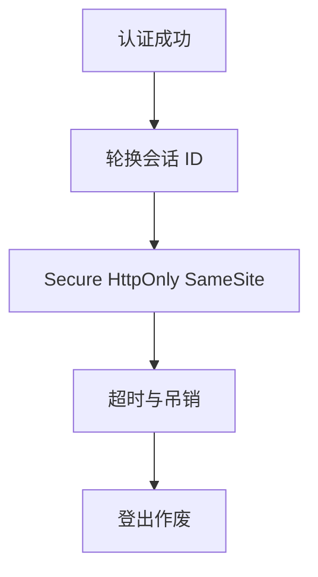

# 会话管理

会话把「已认证」记在服务器或绑定在 cookie 上。标识要不可猜、要随权限变化而更新、要能作废。Secure、HttpOnly、SameSite 是浏览器合同，不是装饰性旗标。

<footer>—— 据 RFC 6265；OWASP 会话管理；对照 Felten 等对 cookie 的早期讨论</footer>

## 定位

上一课[JWT](/cs/jwt-pitfalls)给了一种无状态形状。缺口是**有状态会话仍是默认**：会话 ID、固定、CSRF、超时。不重写 CSRF 课的全部，只把会话生命周期钉进身份单元。

后课默认已经读完本课钉下的合同，只补差，不从该领域第一性原理重开。

## 问题

登录后若不换会话 ID，固定攻击把预种 ID 升级成认证会话——只陈述性质。cookie 缺 Secure 则明文泄漏；缺 HttpOnly 则 XSS 可偷。缺口是生命周期与旗标，不是再讲表单。

### 登出必须作废服务端

删浏览器 cookie 而服务端仍认 ID，等于没登出。

RFC 6265。SameSite 缓解部分 CSRF，不是全部。本课不给窃取 cookie 的步骤。

## 方法

画：认证成功→换 ID→设旗标→绝对与空闲超时→吊销。对照 JWT 访问令牌+刷新。多设备会话要能列与踢。

图中节点是本课的机制骨架；课程不把图展开成可运行的攻击步骤。

## 机制

身份是时间上的状态机。OAuth 下一课把这台机器拆成授权码、重定向与客户端类型——会话仍要，只是多了第三方。

前提写进合同之后，游戏外的误用只当失败模式点名，不在本课写成操作程序。

## 边界

本课不把全部 cookie 前缀写完。OAuth 攻击面下一课。

## 小结

- JWT 无状态；会话 ID 有状态，要轮换与作废。
- 旗标与超时是合同；登出在服务端。
- 固定会话是认证前 ID 被绑上用户。
- 下一课 OAuth 攻击面。
- 出处：RFC 6265；OWASP Session Management；对照 RFC 6819。
