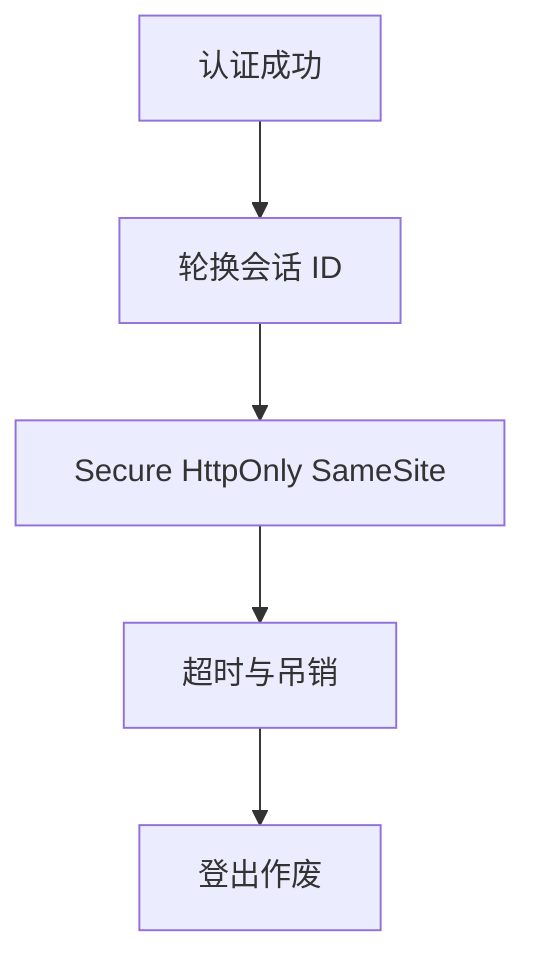
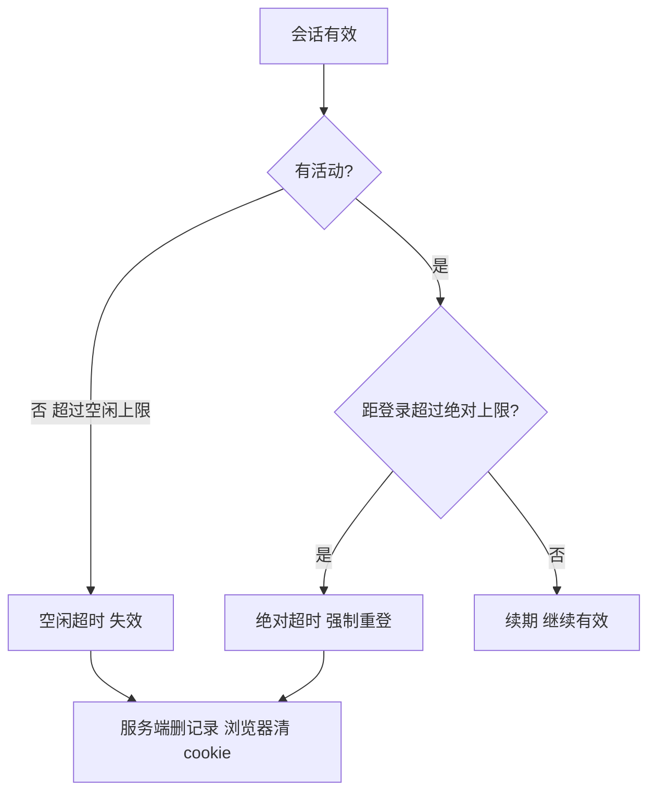

# 会话管理

会话把「已认证」记在服务器或绑定在 cookie 上。标识要不可猜、要随权限变化而更新、要能作废。Secure、HttpOnly、SameSite 是浏览器合同，不是装饰性旗标。

<footer>—— 据 RFC 6265；OWASP 会话管理；对照 Felten 等对 cookie 的早期讨论</footer>

上一课[JWT](/cs/jwt-pitfalls)给了一种无状态形状。缺口是**有状态会话仍是默认**：会话 ID、固定、CSRF、超时。不重写 CSRF 课的全部，只把会话生命周期钉进身份单元。

后课默认已经读完本课钉下的合同，只补差，不从该领域第一性原理重开。

## 问题

登录后若不换会话 ID，固定攻击把预种 ID 升级成认证会话——只陈述性质。cookie 缺 Secure 则明文泄漏；缺 HttpOnly 则 XSS 可偷。缺口是生命周期与旗标，不是再讲表单。

### 登出必须作废服务端

删浏览器 cookie 而服务端仍认 ID，等于没登出。

RFC 6265。SameSite 缓解部分 CSRF，不是全部。本课不给窃取 cookie 的步骤。

术语翻译：「会话固定」就是攻击者先把一个自己知道的会话 ID 种进你的浏览器，等你登录后这个 ID 被升级成认证会话——他拿同一个 ID 就进了门。防御正对应「认证成功即轮换 ID」这一步。

直觉类比：三个旗标像给 cookie 上三把锁——Secure 只走加密通道（防路上被抄）、HttpOnly 不让脚本读（防 XSS 撬锁）、SameSite 跨站请求不带（防 CSRF 冒名）。少一把锁，就多一条被偷的路径。

## 方法

画：认证成功→换 ID→设旗标→绝对与空闲超时→吊销。对照 JWT 访问令牌+刷新。多设备会话要能列与踢。

```mermaid
flowchart TD
  LOGIN["认证成功"] --> ROT["轮换会话 ID"]
  ROT --> FLAG["Secure HttpOnly SameSite"]
  FLAG --> TTL["超时与吊销"]
  TTL --> OUT["登出作废"]
```

## 机制

身份是时间上的状态机。OAuth 下一课把这台机器拆成授权码、重定向与客户端类型——会话仍要，只是多了第三方。

上面那张图是登录到登出的合同清单；下面这张把「时间上的状态机」展开——空闲超时与绝对超时各自在哪个判断点把会话掐掉。

```mermaid
flowchart TD
  A["会话有效"] --> B{"有活动?"}
  B -- "否 超过空闲上限" --> C["空闲超时 失效"]
  B -- "是" --> D{"距登录超过绝对上限?"}
  D -- "是" --> E["绝对超时 强制重登"]
  D -- "否" --> F["续期 继续有效"]
  C --> G["服务端删记录 浏览器清 cookie"]
  E --> G
```

数字实例：空闲超时 30 分钟、绝对超时 12 小时是常见搭配。挂页面去吃饭 40 分钟回来要重登（空闲超时触发）；就算一直在操作，到第 12 小时也被强制重登——绝对超时挡的是「被无限续期的活会话」。

## 边界

本课不把全部 cookie 前缀写完。OAuth 攻击面下一课。

## 小结

- JWT 无状态；会话 ID 有状态，要轮换与作废。
- 旗标与超时是合同；登出在服务端。
- 固定会话是认证前 ID 被绑上用户。
- 下一课 OAuth 攻击面。
- 出处：RFC 6265；OWASP Session Management；对照 RFC 6819。
