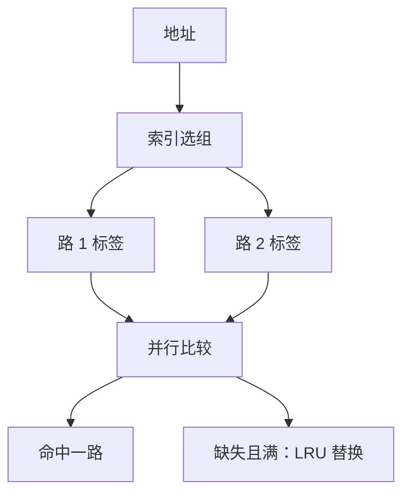

# 组相联与替换

一块可以放进一组里的若干路，冲突不再被唯一一行钉死；组满了才需要替换策略。

<footer>—— 据 Patterson and Hennessy, Computer Organization and Design (RISC-V)；Hennessy and Patterson, CA:AQA 整理</footer>

[上一课](/cs/direct-mapped-cache)用索引选定唯一行。两个块若索引相同就会互踢，哪怕 cache 里还有空行。[局部性原理](/cs/direct-mapped-cache)并没有要求「索引相等的块不能同时热」。本课不重讲标签比较。缺口是：放宽「只能放一个位置」，并在一组多块都满时决定踢谁。本课只交出组相联与替换。

## 问题

直接映射把冲突和容量混在一起：明明还有别的行空着，只因为索引撞了就缺失。全相联让块放任意行，比较器个数随行数线性涨，做不大。缺口是中间形态：**索引选组，组内若干路并行比标签**。

组满之后，新块要替换一路。随机、FIFO、LRU 给出不同的「谁最不值得留」。本课钉 LRU 的直觉（踢最久未用），不把伪 LRU 树展开成门级。

Belady 最优替换需要未来轨迹，只能当分析下界。硬件用过去近似未来。

## 方法

$n$ 路组相联：cache 分成若干组，每组 $n$ 块。地址的索引选组，不再选唯一行；组内 $n$ 个标签并行比较。$n=1$ 就是直接映射；$n=$ 总块数就是全相联。

替换：缺失且组满时，按策略选一路。LRU 维护组内使用次序；命中也要更新次序。写回课才会问被踢的那路是否要写 DRAM；本课假定只读，或假定被踢块与下一层一致。

## 机制

相联度上升，冲突缺失下降，命中时间通常上升（更多比较与 mux）。这是 CPI 里「停顿减少」对「时钟周期变长」的交易，[CPI 与阿姆达尔](/cs/cpi-amdahl)已经准备好这项比较。常用选择是 2 路或 4 路，而不是全相联。

LRU 在相联度高时状态昂贵。教学上 2 路 LRU 只需一位。替换策略改变的是缺失率，不改变命中时的标签语义。

## 边界

本课不引入写分配，不讨论 inclusive/exclusive 多层 cache。也不把替换做成操作系统页置换：那是后课虚拟内存的另一套对象，尽管 LRU 直觉相同。

后课默认：cache 是组相联的；直接映射是 1 路。谈到踢块，先问组是否已满、策略是什么。

## 小结

- 组相联：索引选组，组内多路比标签。
- 组满才替换；LRU 踢最久未用，Belady 只当界。
- 写回与脏位是下一课的缺口。
- 出处：Patterson and Hennessy, *COD* RISC-V；Belady, 1966 最优替换作为分析对照。
