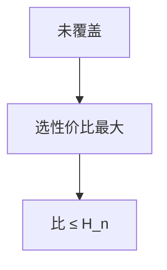

# 集合覆盖贪心

每次选覆盖新元素最多的集合，近似比 $H_n\le \ln n+1$；除非 P=NP 没有 $o(\log n)$ 多项式近似。

<footer>—— 据 Johnson, Approximation Algorithms for Combinatorial Problems, 1974；Chvátal, 1979；CLRS 第 35.3 节整理</footer>

上一课[顶点覆盖 2 近似](/cs/vertex-cover-approx)是集合覆盖的特殊（每元素度 2 时更紧）。一般集合覆盖：宇宙 $n$ 元素，集合族。缺口是贪心 $H_n$。不重写匹配。后课 Christofides TSP。

## 问题

每次选 $\max$ 新覆盖数的集合。分析：未覆盖元素对 OPT 的「价钱」分摊，$k$ 个剩余时本次代价 $\le\mathrm{OPT}/k$，调和数相加 $H_n$。加权 Chvátal：性价比 $w(S)/$新元素。

缺口是调和比，不是 2。

### 顶点覆盖不是 $\ln n$

元素 = 边、集合 = 顶点的关联星时，贪心度仍可能差；用上一课匹配。问题结构决定比。

Johnson 1974。Chvátal 加权。Feige $ (1-\varepsilon)\ln n $ 硬度。后课度量 TSP Christofides。

## 方法

集合用链表或倒排。每步扫未删集合。实现 $O(\sum |S|)$ 量级。

精确指数：状压 $n$ 小。

## 机制

分摊：OPT 的某个集合覆盖了当前剩余里的 $k'$，贪心不差于「平均」。调和来自 $1+1/2+\cdots$。与子模最大化同类贪心。与 LP：对偶拟合给同一 $H_n$。

## 边界

本课不证 Feige 硬度全文。不写部分覆盖。后课默认：集合覆盖贪心 $H_n$。下一课 Christofides。

## 小结

- 贪心性价比，$H_n$-近似。
- 对数比本质（硬度）。
- 特殊图结构可用更紧算法。
- 出处：Johnson, 1974；Chvátal, 1979；CLRS 第 35.3 节。
