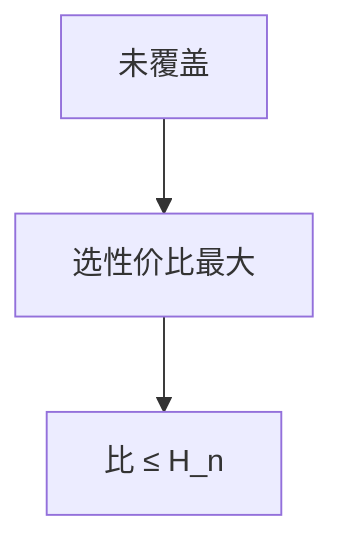
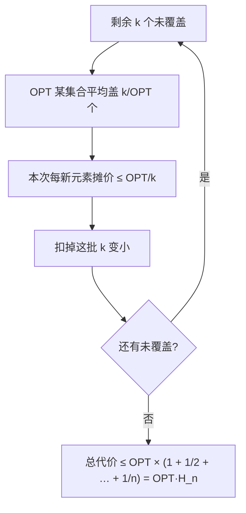

# 集合覆盖贪心

每次选覆盖新元素最多的集合，近似比 $H_n\le \ln n+1$；除非 P=NP 没有 $o(\log n)$ 多项式近似。

<footer>—— 据 Johnson, Approximation Algorithms for Combinatorial Problems, 1974；Chvátal, 1979；CLRS 第 35.3 节整理</footer>

上一课[顶点覆盖 2 近似](/cs/vertex-cover-approx)其实已是集合覆盖的特例——元素退化为边、集合退化为顶点的关联星时能压到 2。一般集合覆盖：宇宙 $n$ 个元素、一个集合族，求最少的集合盖住全部。缺口是贪心的 $H_n$ 比。本课不重写匹配；后课 Christofides TSP。

## 问题

贪心每次选覆盖新元素最多的集合。分析靠分摊记账：还剩 $k$ 个未覆盖元素时，OPT 的集合平均每个盖住其中 $k/\mathrm{OPT}$ 个以上，按「每个新元素摊到的价钱」算，本次每元素代价 $\le\mathrm{OPT}/k$。剩余数一路下降，价钱逐级翻倍相加，恰是调和级数 $1+1/2+\cdots+1/n=H_n\le\ln n+1$。加权版 Chvátal：改按性价比 $w(S)/\text{新元素数}$ 选，同一本账。

缺口是调和比 $H_n$，不是 2。

### 顶点覆盖不是 $\ln n$

顶点覆盖虽是特例，却拿不到 $\ln n$：一般贪心在那样的结构上仍可能差过 2，紧界要靠上一课的匹配下界。问题结构决定近似比，不是越一般越松。

Johnson 1974。Chvátal 加权。Feige $ (1-\varepsilon)\ln n $ 硬度。后课度量 TSP Christofides。

数字实例：$n=100$ 时 $H_{100}\approx 5.19$，即贪心解至多约是 OPT 的 5.2 倍——若最优解用 3 个集合，贪心至多约 16 个。不算好，但这是「不差于对数倍」的硬底线；且 Feige 硬度说明没有多项式算法能做得显著更好。

## 方法

实现：集合用倒排索引（元素指向包含它的集合），每步扫一遍找新覆盖最多的；已选集合惰性删除，总量级 $O(\sum |S|)$。

术语翻译：「倒排索引」就是不从集合找元素、反过来从元素查集合——像书后的关键词索引：想覆盖某个元素，先查它出现在哪些集合里，再挑性价比最高的，省掉每轮把所有集合全扫一遍的浪费。

```mermaid
flowchart TD
  U["未覆盖"] --> GRD["选性价比最大"]
  GRD --> HN["比 ≤ H_n"]
```

$n$ 小到几十时可状压精确求解，指数换最优。

## 机制

机制就是分摊论证：OPT 的某集合总盖住剩余的至少 $1/\mathrm{OPT}$ 比例，贪心不差于这个「平均」，每元素摊价随剩余减少而几何上升，调和级数由此而来。它与子模函数最大化的贪心同族——覆盖函数是典型子模，「新元素」计数的理由正是边际收益递减。LP 视角：整数规划的对偶是 packing，对偶拟合同样给出 $H_n$，两条路殊途同归。

上面那张图是贪心的选择动作；下面这张把分摊论证画成循环——$H_n$ 就是这个循环里逐级上升的摊价之和。

```mermaid
flowchart TD
  A["剩余 k 个未覆盖"] --> B["OPT 某集合平均盖 k/OPT 个"]
  B --> C["本次每新元素摊价 ≤ OPT/k"]
  C --> D["扣掉这批 k 变小"]
  D --> E{"还有未覆盖?"}
  E -- "是" --> A
  E -- "否" --> F["总代价 ≤ OPT × (1 + 1/2 + … + 1/n) = OPT·H_n"]
```

直觉类比：分摊记账像买散装货——剩得越多平均每件越便宜，剩得越少平均每件越贵；把每个「层次」的贵价按 $1, 1/2, 1/3,\dots$ 加总，正好是调和级数，这就是 $H_n$ 的来处。

## 边界

本课不证 Feige 硬度，只点名结论：$(1-\varepsilon)\ln n$ 以内的近似即推出 P=NP——对数比是本质的，不是分析不紧。不写带罚金的部分覆盖变体。后课默认：集合覆盖贪心 $H_n$。下一课 Christofides。

## 小结

- 贪心性价比，$H_n$-近似。
- 对数比本质（硬度）。
- 特殊图结构可用更紧算法。
- 出处：Johnson, 1974；Chvátal, 1979；CLRS 第 35.3 节。
