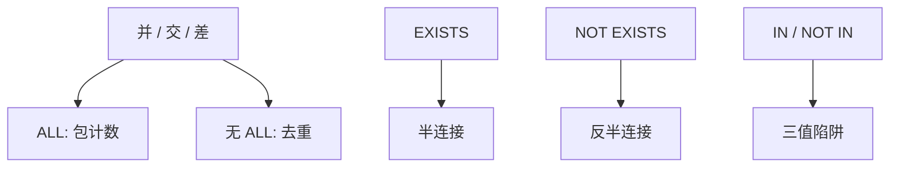

# 集合运算与 EXISTS

并交差是关系代数的原语；EXISTS 是演算里的存在量词。SQL 两者都给，指称要对齐，NULL 与包会把对齐撕开一条缝。

<footer>—— 据 Codd 关系代数与元组演算；Date 对 EXISTS；Ramakrishnan and Gehrke 整理</footer>

[上一课](/cs/recursive-cte)用迭代并逼近传递闭包。本课不重写不动点。缺口是日常查询里的**集合级对照**：`UNION`/`INTERSECT`/`EXCEPT`，以及 `EXISTS`/`NOT EXISTS`。主干代数课有并交差，SQL 声明课点到 `UNION`；进阶要把包版本、对应列、存在量化与半连接一次钉清。

## 问题

用户写「在 A 不在 B」「A 与 B 都有的键」。用 `NOT IN` 子查询遇到 NULL 会得到 UNKNOWN，整句滤掉过多行——[三值](/cs/sql-null) 已警告。`NOT EXISTS` 按行相关探测内层是否非空，对 NULL 更符合「不存在匹配」的直觉。缺口不是再讲嵌套语法，而是**集合运算与存在量化何时同指称、何时必须分开**。

`UNION` 去重，`UNION ALL` 保留包计数。`INTERSECT`/`EXCEPT` 同样有 ALL 变体。对应列要可比较、模式对齐。集合运算两侧先投影到同一目，再做袋或集合运算。

Codd 的演算用 ∃ 表达连接与选择。SQL 的 `EXISTS (SELECT * FROM …)` 不关心投影列，只关心非空。半连接实现它；反半连接实现 `NOT EXISTS`。去相关课已用过这组算子，本课从语言对照补齐。

## 方法

集合运算：两输入关系（包）模式兼容 → 并/交/差。优化器可把 `EXCEPT` 变成反半连接或哈希差。`EXISTS`：对每个外层行求内层是否非空，允许内层一旦找到一行就停。`IN` 列表是等值存在，遇 NULL 走三值；能改写为半连接时必须复制该三值行为，否则指称错。

相关 `EXISTS` 与不相关 `EXISTS`：后者可先判一次真假；前者依赖外层。本课不把 `UNIQUE` 谓词、`MATCH` 的全部标准角落写完。

## 机制

执行上，哈希差与排序归并差对应两种物理形状，与连接算法同源：一边建哈希或两边排序。`EXISTS` 短路径：内层有索引时相关探测很便宜，这是去相关课「保留 NLJ」的例子。`UNION` 后的 `ORDER BY` 只对总结果排序，不能假设某一侧的序还在。

递归 CTE 的 `UNION` 与本课 `UNION` 同一代数，只是一侧在迭代中增长。本课不回头重讲停机。

## 边界

本课不把外连接引进来：外连接保留未匹配侧并填 NULL，与差、反半连接都不同。下一课专讲外连接与半连接的对照。也不把集合运算当完整性约束的替代——约束是后课触发器与声明约束。

后课默认：写「不存在」优先考虑 `NOT EXISTS` 或差，而不是 `NOT IN` 碰 NULL。集合运算是代数原语，存在量化是演算原语，计划上常汇合到半连接族。

包与集合必须在语句里显式选择（ALL 或否），不能靠引擎「顺便去重」。

## 小结

- `UNION`/`INTERSECT`/`EXCEPT` 有集合与包两档；模式必须对齐。
- `EXISTS` 即半连接；`NOT IN` 与 `NOT EXISTS` 在 NULL 下不同指称。
- 外连接与半连接下一课，补「保留未匹配」。
- 出处：Codd；Date；Ramakrishnan and Gehrke。
