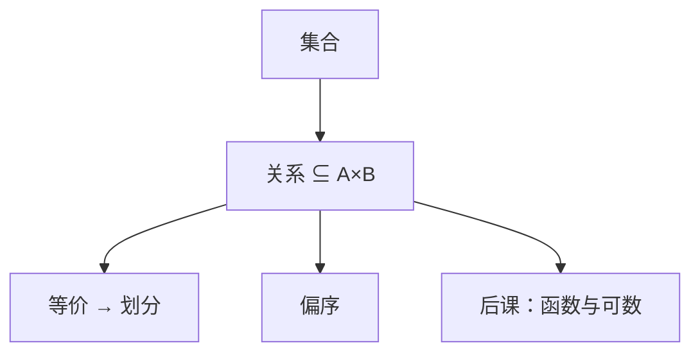

# 集合与关系

把对象收成集合，把「谁连着谁」写成有序对的集合，后面的函数、图和归纳才有载体。

<footer>—— 据 Rosen, Discrete Mathematics and Its Applications 整理</footer>

上一课[静态与动态险象](/cs/static-dynamic-hazard)把组合逻辑的手算化简收到头：函数、无关项、毛刺都在布尔格子上。本课不重画卡诺图，也不从「数学基础」另起一篇集合论。缺口是：后课要谈可数、图、树、概率，对象不再是 $n$ 个比特的真值表。需要一套更瘦的语言：**集合**，以及集合上的**关系**。

## 问题

布尔函数是 $\{0,1\}^n$ 到 $\{0,1\}$ 的对应。图的边、偏序、后课的「可达」，都不是「输出比特」。缺口因此不是新的门，而是：从论域 $A$ 取出子集，再在 $A\times B$ 上取出哪些有序对算「有关系」。关系可以自反、对称、传递；等价关系诱导划分；偏序才谈得上拓扑与后课 DAG。

本课只钉这些定义。函数是特殊关系，下一课才加单射、满射、可数。电路不再在本课出现。

### 关系不是「两个集合有联系」的散文

$R\subseteq A\times A$ 是确定的集合。说「朋友关系」却不给出有序对，后课图论没有边集。有序对 $(a,b)$ 与 $\{a,b\}$ 不同：有向与无向在这里已经分叉，[图的定义](/cs/graph-definition)会分别写。

Rosen 用关系矩阵与有向图当同一关系的两种像。本课不把矩阵乘法当复合的算法分析，只要求复合 $S\circ R$ 仍是关系。

## 方法

外延公理：集合由元素决定。幂集、笛卡尔积按常规定义。关系的性质逐条检查，不混用：「对称且传递却不自反」可能发生在空关系等边角，本课不靠边角讲课，主干用等价 $\Leftrightarrow$ 划分。

## 机制

后课图 $G=(V,E)$ 就是 $E$ 作为关系（无向则要求对称且通常无自环）。等价关系给「同余、同一连通分量」提供语言。布尔代数可以解释成某集合的幂集运算，那是解释，不是本课要把门再讲一遍。

有限与无限在本课只作区分：有限集可与 $\{1,\ldots,n\}$ 双射。真正的可数、不可数是下一课。归纳需要自然数，也还没进场。

## 边界

本课不讨论选择公理、基数算术的争议，不把 Russell 悖论展开成课程。也不把关系数据库提前到本栏数据库课：关系在这里是离散数学对象；Codd 的关系模型是很后面的叶子。

后课默认：谈到「一对对象是否相关」，先给出 $R$ 作为集合。图、函数、序都从这里长出。

## 小结

- 集合由元素确定；关系是有序对的集合。
- 等价对应划分；偏序是后课 DAG 的序来源之一。
- 函数、可数、图都是本课之后的特化，不在本课重讲门。
- 出处：Rosen, *Discrete Mathematics and Its Applications*。
