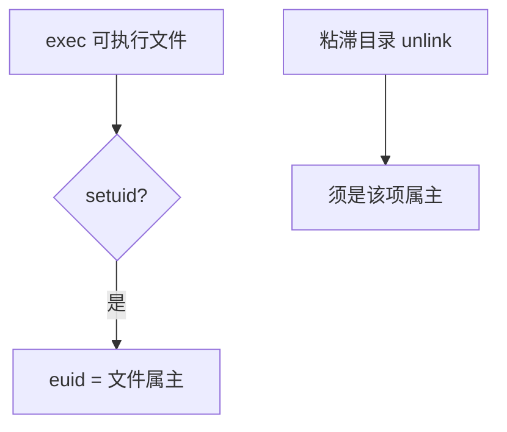

# setuid 与粘滞位

setuid 可执行文件在 exec 后把有效用户换成文件属主；粘滞目录只允许用户删除自己的目录项。

<footer>—— 据 Ritchie and Thompson 对 setuid 的原始设计；Bach；POSIX 整理</footer>

[上一课](/cs/file-mode-bits)按有效身份检查 rwx。有些程序需要暂时以另一用户访问文件（口令改密），但不能把该用户的口令写进所有调用者。[进程映像](/cs/process-image) 的 exec 会换映像。缺口是 **setuid/setgid 与粘滞位**：改有效身份，以及 `/tmp` 上的删除规则。本课讲机制，不讲如何利用错误配置。

## 问题

若 passwd 必须以 root 写口令文件，又必须以普通用户调用，缺口是 exec 时把有效 uid 设为二进制文件的属主（通常 root），真实 uid 仍记录调用者。内核在打开文件时用有效 uid。粘滞位在目录上：即使目录可写，也不得删别人的文件名。setgid 对文件类似换有效 gid；对目录可表示「新建文件继承目录组」。

本课不把 Linux 文件能力（capabilities）的全部位图写完。

解释器脚本的 setuid 历史上不安全，许多系统忽略脚本上的 setuid。可执行映像才提升。本课不给绕过步骤。

## 方法

`chmod u+s`：mode 里 setuid 位置位。`execve` 通过 [模式](/cs/file-mode-bits) 的 x 检查后，若 setuid 则 euid←属主。后续 `open` 用 euid。程序可 `seteuid` 在真实与有效之间收放（受规则限制）。粘滞目录：`unlink`/`rename` 额外检查调用者是否为目录项属主或有特权。VFS 在这些系统调用里执行检查，FS 只存那一位。

## 机制

setuid 是受控的身份切换，把「需特权的操作」收进特定二进制，而不是给用户永久 root。粘滞位修复「目录可写则人人可删别人文件」。两者都是 mode 的额外位，不改页表。[系统调用路径](/cs/syscall-path) 上检查发生在 VFS，与具体 ext4 日志无关。

安全课会谈最小特权与审计；本课只把位接到 exec 与 unlink。

## 边界

本课不分析具体漏洞，不讲提权步骤。nosuid 挂载可忽略 setuid，容器课会再提。下一课离开权限，进入块层：许多已经允许的读写，请求如何排序送向设备。

后课默认：身份与 `/tmp` 规则已定。块请求的电梯与多队列，下一课磁盘调度。

## 小结

- setuid 在 exec 时改 euid；粘滞位限制可写目录上的删除。
- 检查在 VFS；本课不讲利用。
- 块层调度是下一课。
- 出处：Ritchie and Thompson；Bach, *UNIX*；POSIX。
