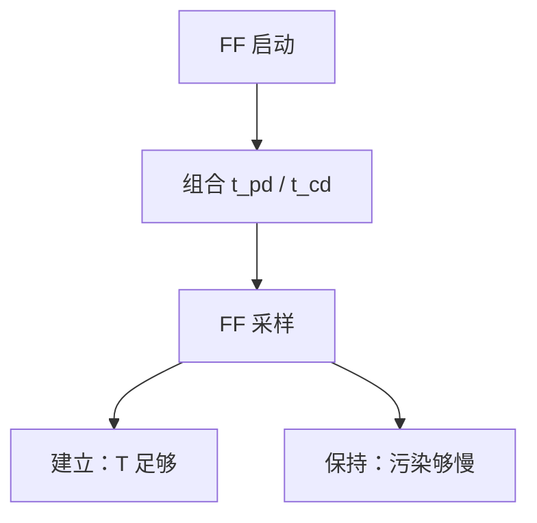

# 建立保持时间

数据必须在时钟边沿之前稳定一段建立时间，边沿之后再保持一段；否则触发器可能进入亚稳，Q 不是合法比特。

<footer>—— 据 Harris and Harris, Digital Design and Computer Architecture 整理</footer>

上一课[D / T / JK 对照](/cs/flipflop-types)钉死了边沿 D 触发器当记忆。本课不重画主从结构，也不从器件噪声统计另起。缺口是：FF 不是「边沿一瞬间任意 D 都行」。它要求 D 在边沿前后各有一段稳定窗口——**建立** $t_{su}$ 与**保持** $t_h$。

## 问题

组合块有 $t_{pd}$、$t_{cd}$。两级 FF 之间夹着组合。缺口是把窗口写成不等式：周期 $T$ 须满足 $t_{cq}+t_{pd}+t_{su}\le T$（另加时钟偏斜），否则建立失败，下一拍采样到未稳数据。保持：$t_{cd}+t_{hold\_path}\ge t_h+t_{skew}$ 一类，污染太快会冲掉刚锁存的值。

本课只钉这两条。多周期路径、假路径是工具细节。亚稳若仍发生，解析时间概率衰减，后课跨时钟域才强调同步器。

### 加周期不能修保持

建立失败可以降频。保持失败与 $T$ 无关，必须加延迟或改路径。把所有时序问题都「把时钟调慢」，保持违规会留下。

Harris 给出带 skew 的建立/保持不等式。时钟偏斜下一课寄存器仍当理想，多域在[时钟域](/cs/clock-domain)才展开。本课先承认 skew 一项。

## 方法

单周期同步：同一时钟的 FF 到 FF。最坏 $t_{pd}$ 管建立，最好 $t_{cd}$ 管保持。缓冲器可以修保持（加大 $t_{cd}$），但可能恶化建立。

## 机制

后课单周期 CPU 的 $T$ 由最长指令路径加 $t_{su}$ 决定。流水线把路径切开，每级仍要满足本课不等式——那是体系结构课的叶子，本课只给尺子。毛刺若落在采样窗口外则无事；落在窗口内等于 D 在边沿抖动。

## 边界

本课不把时序签核工具的 SDC 写成教程，不分析锁相环抖动谱。异步输入必须按后课时钟域同步，本课不等式对它不成立。

后课默认：同步设计先满足建立与保持；周期由建立定下界，保持用路径延迟保证。

## 小结

- 建立约束决定最小周期；保持与周期无关。
- $t_{pd}$ 对建立，$t_{cd}$ 对保持。
- 降频修不了保持违规。
- 出处：Harris and Harris。
