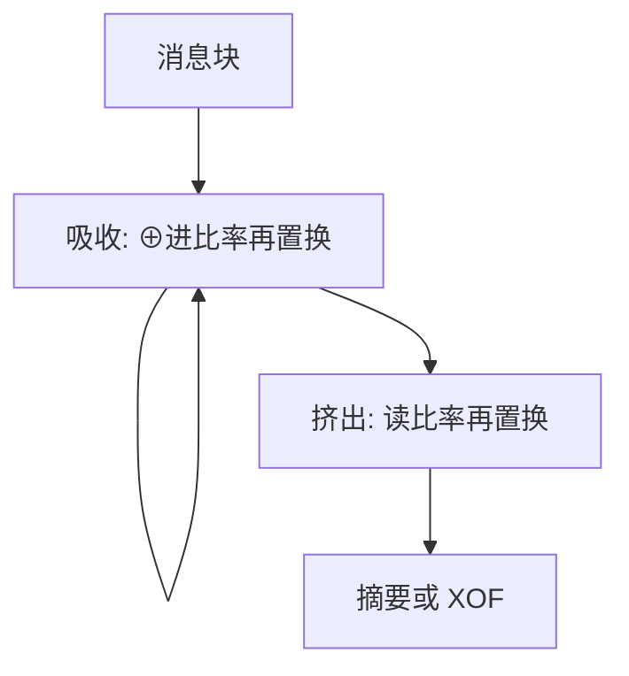

# SHA-3 海绵

海绵把一个宽置换反复用：先吸收消息进状态，再挤出摘要。输出不必等于整个内部状态，长度扩展那类 MD 遗产从结构上被拆掉。

<footer>—— Bertoni, Daemen, Peeters and Van Assche, Cryptographic sponge functions；NIST FIPS 202</footer>

## 定位

上一课[Merkle–Damgård](/cs/merkle-damgard)的链接值即摘要前缀。缺口是**另一族**：Keccak 海绵，SHA-3 与 SHAKE。不重写碰撞三条性质，只换构造。

后课默认已经读完本课钉下的合同，只补差，不从该领域第一性原理重开。

## 问题

MD 的最终摘要往往就是链状态（或截断但仍泄漏可继续的状态）。海绵：状态分比率 $r$ 与容量 $c$，吸收阶段把消息块异或进 $r$，再做置换 $f$；挤出阶段读 $r$。容量不直接输出，长度扩展不再「接着压一块」。缺口是海绵的吸收/挤出，不是再背 SHA-256 圈数。

### SHAKE 是 XOF

挤出可任意长，当 PRG 式派生时要换域分离，避免与哈希同一上下文。

FIPS 202。Keccak 置换是 1600 比特。本课不把 SHA-3 写成「SHA-2 被破所以必须换」——SHA-2 仍广泛安全；SHA-3 是结构多样性。

## 方法

画吸收循环与挤出循环。对比 MD 的单向链。指出 SHAKE128/256 的可变输出。HMAC 对 SHA-3 仍可用，但海绵有 KMAC 更贴结构。

图中节点是本课的机制骨架；课程不把图展开成可运行的攻击步骤。

## 机制

容量 $c$ 对应安全边际：内部有不输出的部分。这服务抗碰撞与原像，前提是 $f$ 像随机置换。它不自动给 MAC；密钥如何拌进海绵，是域分离问题，下一课与 HMAC 一起收。

前提写进合同之后，游戏外的误用只当失败模式点名，不在本课写成操作程序。

## 边界

本课不写 Keccak 圈函数的 θρπχι 全套。长度扩展与 HMAC 下一课专门关 MD 遗产，并说明为何「$H(k\|m)$」不够。

## 小结

- MD 链状态等于可续写的内部。
- 海绵：吸收/挤出，容量不直接输出。
- SHA-3 与 SHAKE 是 FIPS 202；与 SHA-2 并存。
- 下一课：长度扩展为何逼出 HMAC。
- 出处：Bertoni et al., sponge；NIST FIPS 202。
