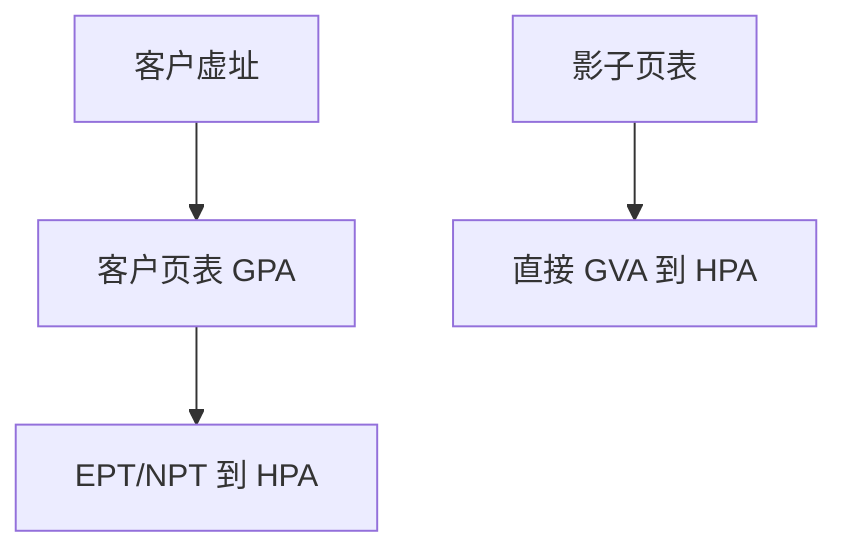

# 影子页表

没有 EPT 时，VMM 维护影子页表：客户 VA→宿主 PA，客户改 CR3/pte 要退出同步；有 EPT 则硬件走两维翻译。

<footer>—— 据 Adams and Agesen 对软件 MMU 的论述；Intel EPT；[分页](/cs/demand-paging) 为先修</footer>

[VM-exit](/cs/vmx-vmexit) 的大户曾是页表。[rmap](/cs/rmap) 是宿主。缺口是 **影子 vs EPT**：嵌套页表如何减少 exit。

## 问题

客户以为自己管 PA。实际 GPA 要到 HPA。影子：VMM 把客户页表「编译」成一份给硬件的表。EPT：硬件 gva→gpa→hpa。缺口：缺页：客户缺页 vs EPT 缺页（需 VMM 补宿主页）。本课不把 NPT 字段写完。

大页 THP 在 EPT 上也有对应。对象是翻译，不是客户 malloc。

## 方法

无 EPT：拦截客户页表写。有 EPT：建 EPT 树，客户 CR3 仍是 GPA。对照 [KPTI](/cs/kpti-os)：都是多套页表，目的不同。对照 [IOMMU](/cs/dma-coherence)：设备翻译第三维，后课 VFIO。

## 机制

EPT 把 MMU 虚拟化从「每次改 pte 都 exit」变成硬件走两层，是内存虚拟化的分水岭。影子仍用于无硬件或特殊调试。不要写成 CPU TLB 微架构课。与 [memcg](/cs/memcg)：宿主页仍 charge QEMU。

换页：客户 swap 与宿主 swap 叠两层，会很惨。

实现上：EPT 违例分：客户该自己处理的缺页 vs 宿主还没映射 GPA。大页 EPT 能减 VM-exit。影子页表在客户频繁换 CR3 时同步成本高。 读法上只引用[上一课](/cs/vmx-vmexit)的结论，不把对象换成训练推理或限价簿。

本课在操作系统进阶的「虚拟化与隔离进阶 / Hypervisor」课序里，对象是 **影子页表**。

- 先修只引用，不重导：上一课的结论当公理，本课只补差。
- 五栏不吞并：不把本课写成大模型训练/推理，也不写成限价簿或权重量化。
- 文献用 OSTEP、McKusick、内核文档与具名会议论文；不发明 arXiv 编号。

## 边界

本课不引入影子 paging 的全部优化（如跟踪脏）。不保证 RISC-V G 阶段细节。下一课减少 exit 的另一法：半虚拟化。

版本字段会变，课序钉的是机制对象「影子页表」，不是某一主线内核的结构体名。
后课默认：嵌套页表翻译 GPA。virtio 一类半虚拟接口，下一课。

## 小结

- 影子页表软件同步；EPT 硬件二维翻译。
- 缺页要分清客户与 EPT。
- 半虚拟化是下一课。
- 出处：Adams/Agesen；Intel EPT；KVM mmu。
