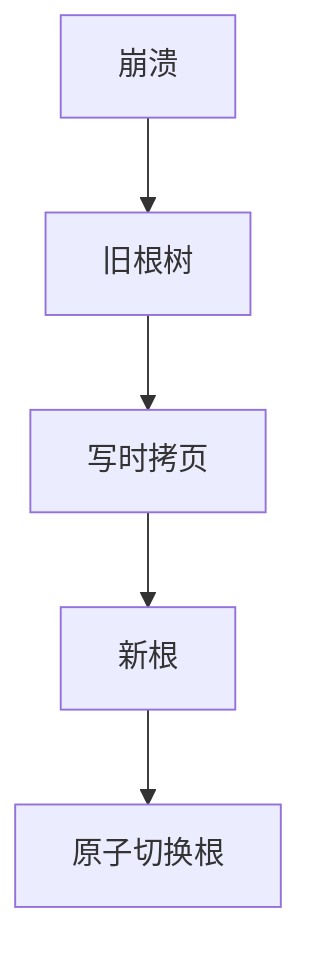

# 影子分页对照

影子分页写新页并切换根：提交即新树可见，无需 redo 前滚。随机写与大目录更新是代价，现代 OLTP 主路径仍是 WAL 原地。

<footer>—— 据 Lorie 影子分页；Gray and Reuter 对照；SQLite 回滚模式点名</footer>

[上一课](/cs/logging-granularity)选了记什么。本课对照**不原地更新**的恢复：影子分页（shadow paging）。主干 WAL 是主路径；进阶用对照理解为何 ARIES 赢在随机 I/O 与细粒度。组提交下一课把 WAL 刷盘摊掉。

## 问题

每页有当前与影子。事务写时拷页到新位置（COW），修改页表（或文件 inode 树）。提交：原子切换根指针（一次 I/O）。崩溃：根仍指旧树，新页丢弃。缺口是**页表本身很大**：更新一条索引可能级联大量目录页，写放大；难以 steal 单页而不暴露。并发：两事务 COW 同一页要合并。

SQLite 历史上 rollback journal / WAL 模式切换，是影子与日志在嵌入式上的产品对照。LMDB 一类 COW B+ 也是影子亲戚。

Raymond Lorie 影子分页。Gray and Reuter 分析为何大型系统偏 WAL。本课不是教「用影子替换 InnoDB」。

## 方法

读：跟随当前根。写：分配新页号，拷旧，改，更新父（可能再 COW）。提交：fsync 新页与新根。检查点：可丢弃不可达旧页当 GC——与 MVCC 版本回收神似，粒度为页。

与 WAL 混合：写前日志仍可有，影子管页原子。现代常用 WAL+原地+doublewrite，少用纯影子。

## 机制

优点：恢复快（几乎不用 redo 长扫描），实现直观。缺点：随机分配页破坏聚簇、碎片、并发粒度粗、目录更新重。LSM 不可变文件+元数据指针切换，是文件级影子，吸收了「切换根」思想而把随机写变成顺序文件。

ARIES 用顺序日志换随机数据页延迟写，与影子的随机新页对偶。

## 边界

本课不讲组提交。也不把 ZFS CoW 当数据库事务。RTO 下一课之后量化。

后课默认：大型并发库用 WAL+ARIES；影子/COW 出现在嵌入式或文件级元数据。组提交：多事务共享一次 fsync。

影子的原子单位是根切换；WAL 的原子单位是日志尾。

## 小结

- 影子 COW+切根，恢复简单，随机写与目录放大差。
- LSM/文件元数据吸收了切根思想。
- 组提交下一课：摊掉 WAL 的 fsync。
- 出处：Lorie；Gray and Reuter；SQLite/LMDB 对照。
