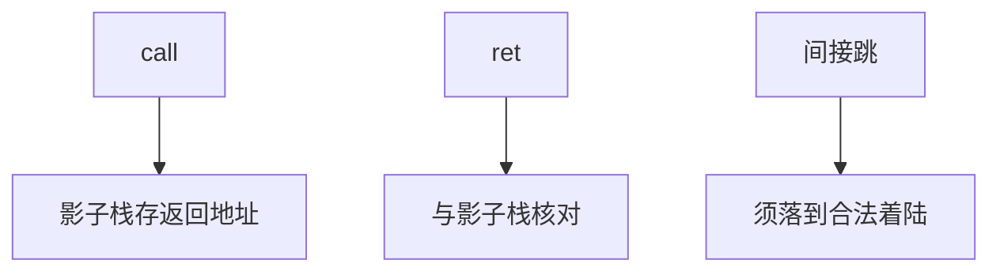

# 影子栈与 CET

影子栈把返回地址放进攻击者默认不可写的第二份栈；CET 再给间接跳加「合法目标」标记。硬件把 CFI 从编译器希望变成页表与指令集合同。

<footer>—— Intel CET 白皮书；对照 Abadi CFI；Microsoft 对 HW-enforced stack protection 的陈述</footer>

## 定位

上一课[类型混淆](/cs/type-confusion)仍可能改函数指针。缺口是**硬件协助的控制流**：影子栈与 IBT。不重写 ROP 定义，只补不能单靠软件希望。

后课默认已经读完本课钉下的合同，只补差，不从该领域第一性原理重开。

## 问题

软件 CFI 可被同进程任意写削弱。影子栈：`call` 压两份，`ret` 核对。IBT：间接跳只落到 `endbr` 一类着陆点。缺口是覆盖率（哪些库编译进去）与兼容。

### 不是内存安全

数据面仍可改。只是返回与部分间接边变贵。

Intel CET。ARM 有 PAC（下一课）与 BTI。本课不写绕过 CET 的步骤。

## 方法

对照软件影子栈与硬件。指出 JIT 要发着陆指令。与 ASLR 叠加。下一课 PAC：签指针本身。

图中节点是本课的机制骨架；课程不把图展开成可运行的攻击步骤。

## 机制

控制边被硬件当一等对象。下一课指针认证：把签名放进指针高位，改指针要过密钥。

前提写进合同之后，游戏外的误用只当失败模式点名，不在本课写成操作程序。

## 边界

本课不给关闭 CET 的利用。PAC 下一课。

## 小结

- 类型混淆仍要改控制数据；CET 让返回/间接跳变硬。
- 影子栈核对返回；IBT 限制着陆点。
- 覆盖率取决于编译与 JIT。
- 下一课指针认证 PAC。
- 出处：Intel CET；Abadi et al.；对照 ARM BTI。
