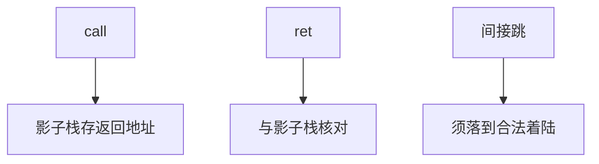
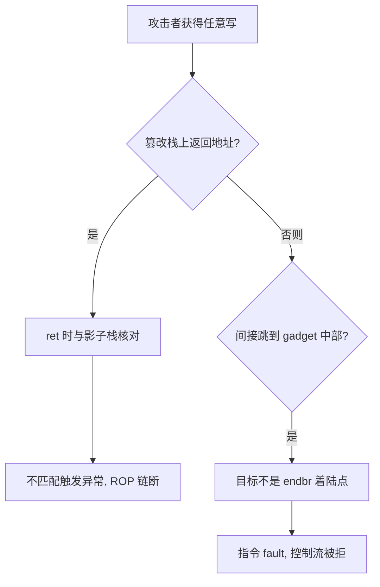

# 影子栈与 CET

影子栈把返回地址放进攻击者默认不可写的第二份栈；CET 再给间接跳加「合法目标」标记。硬件把 CFI 从编译器希望变成页表与指令集合同。

<footer>—— Intel CET 白皮书；对照 Abadi CFI；Microsoft 对 HW-enforced stack protection 的陈述</footer>

上一课[类型混淆](/cs/type-confusion)的落点仍可能是改函数指针。缺口是**硬件协助的控制流完整性**：影子栈与间接分支跟踪（IBT）。本课不重写 ROP 定义，只补：控制流合同为何不能只靠软件自觉，要落到页表与指令集。

后课默认已经读完本课钉下的合同，只补差，不从该领域第一性原理重开。

## 问题

软件 CFI 在每个间接跳前插检查，但检查同在进程内存里——攻击者拿到任意写，检查可被改写或跳过。硬件版把两份合同搬进任意写够不着的层。影子栈：`call` 把返回地址同压两份栈，`ret` 核对，不匹配即异常——ROP 靠改栈上返回地址串联，从此必被抓住。IBT：间接跳与间接调用只许落在 `endbr` 一类着陆点，落到 gadget 中部即 fault。剩下的缺口在覆盖：哪些库与 JIT 代码进了合同，旧二进制如何兼容。

### 不是内存安全

这不是内存安全：任意写仍在，数据面的指针与长度字段照样能改。变的只是返回与部分间接边：从「希望没被改」到「改了必被抓住」。

Intel CET。ARM 有 PAC（下一课）与 BTI。本课不写绕过 CET 的步骤。

直觉类比：影子栈像把返回地址另抄一份锁进保险柜——主栈随便被翻动，`ret` 时先开保险柜核对，对不上就报警。攻击者即便能改主栈，也摸不到保险柜：那份副本由独立页表权限看守，任意写默认够不着。

## 方法

对照软件影子栈与硬件版：合同相同，托管运行时早已软件实现，硬件把核对挪进微码与页表权限。两个工程落点：JIT 代码必须显式发 `endbr`，否则合法间接跳被误杀；CET 与 ASLR 叠加——IBT 先压缩可用 gadget 集，ASLR 再让可达位置随机。下一课 PAC：签指针本身。

数字实例：一条典型 ROP gadget 只有几条指令（十来个字节量级），且可从任意指令边界起跳；IBT 生效后，间接跳只许落在 `endbr` 标记处，可用「跳板」从全部指令边界收缩到编译器显式点名的位置——可拼链条数直接掉几个数量级，ASLR 再给剩下那点雪上加霜。

```mermaid
flowchart TD
  CALL["call"] --> SS["影子栈存返回地址"]
  RET["ret"] --> CMP["与影子栈核对"]
  IJ["间接跳"] --> ENDBR["须落到合法着陆"]
```

## 机制

机制的转变是把控制边当一等对象由硬件看管：返回边靠影子副本核对，间接边靠着陆点白名单，两份核对都在任意写够不着的层执行，不再依赖「攻击者恰好没改检查」这一软件 CFI 软肋。代价随之清楚：影子栈要独立存储与切换语义（信号、协程要接住），IBT 对缺 `endbr` 的旧代码是可用性风险。下一课指针认证换一条路：签名放进指针高位，改指针要过密钥——从看管边到看管指针。

```mermaid
flowchart TD
  W["攻击者获得任意写"] --> Q1{"篡改栈上返回地址?"}
  Q1 -->|是| SS["ret 时与影子栈核对"]
  SS --> X1["不匹配触发异常, ROP 链断"]
  Q1 -->|否则| Q2{"间接跳到 gadget 中部?"}
  Q2 -->|是| IBT["目标不是 endbr 着陆点"]
  IBT --> X2["指令 fault, 控制流被拒"]
```

常见误区：初学者容易把 CET 当成内存安全的代名词。任意写依旧存在——数据指针、缓冲区长度照样能改；CET 只锁「控制流转移边」这两类，改动数据面的漏洞它一概不管，所以要和 ASLR、类型安全语言分层叠加。

## 边界

本课不给关闭或绕过 CET 的利用步骤；软件影子栈与硬件启用的平台差异只作定性。PAC 下一课。

## 小结

- 类型混淆仍要改控制数据；CET 让返回/间接跳变硬。
- 影子栈核对返回；IBT 限制着陆点。
- 覆盖率取决于编译与 JIT。
- 下一课指针认证 PAC。
- 出处：Intel CET；Abadi et al.；对照 ARM BTI。
