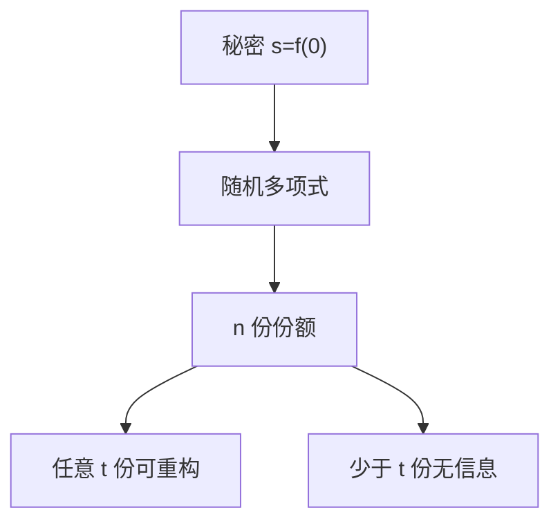

# Shamir 秘密共享

把秘密当成多项式在 0 处的值，发给每人一个点；$t$ 个点能插值，$t-1$ 个点在信息论上什么都不知道。阈值由多项式次数决定。

<footer>—— Shamir, How to Share a Secret, Communications of the ACM, 1979</footer>

## 定位

上一课[承诺与 Merkle](/cs/commitment-merkle-tree)把一个值绑进公开根。缺口是**不公开、但要多人共管**：任何少于阈值的集合不应得到秘密。HSM 备份常走这条，而不是把根钥复印 n 份。

后课默认已经读完本课钉下的合同，只补差，不从该领域第一性原理重开。

## 问题

把密钥切成 n 段明文，任何一段都可能泄漏部分比特。Shamir：在有限域上随机 $t-1$ 次多项式，$f(0)=s$，份额是 $(i,f(i))$。完善保密：少于 $t$ 个点时 $s$ 仍均匀。缺口是阈值方案，不是再讲 HKDF。

### 份额也是密钥材料

存份额的主机被全拿仍达阈值。分发信道要保密且认证，否则份额被换（主动敌手）。

Shamir 1979。Feldman/Pedersen 可验证共享防经销商作恶，本课点名，细节留给 MPC。不要与「把文件 zip 分卷」混淆。

## 方法

用次数 1 的直线在黑板上点名「两点定线、一点不定」。推广到 $t$。指出重构是拉格朗日插值，实现要在域上算，并防份额编号重复。

图中节点是本课的机制骨架；课程不把图展开成可运行的攻击步骤。

## 机制

信息论安全的拆分服务托管与灾难恢复。它不提供计算：份额持有人如何**一起签名还不重构明文私钥**，是下一课门限与 MPC。重构后的 $s$ 又回到单点，策略上应在 HSM 内完成重构。

前提写进合同之后，游戏外的误用只当失败模式点名，不在本课写成操作程序。

## 边界

本课不写主动攻击下的份额注入步骤。下一课门限签名与 MPC 直觉：计算发生在秘密共享之上。

## 小结

- 承诺藏一个值；共享把值拆给多人。
- Shamir：$t$ 点重构，$t-1$ 无信息。
- 份额信道要保密认证；重构点仍是 TCB。
- 下一课：门限签名与 MPC。
- 出处：Shamir, 1979；对照 Stinson 的密码学教材章节。
